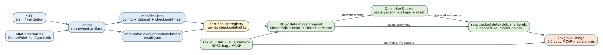
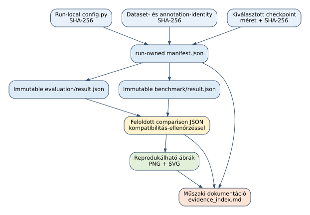
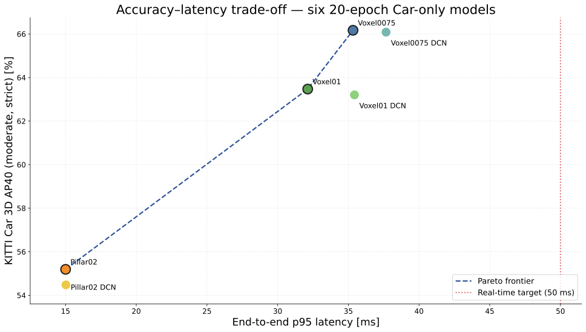
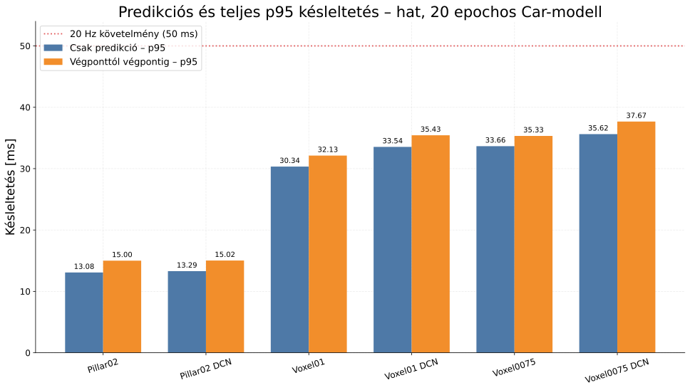
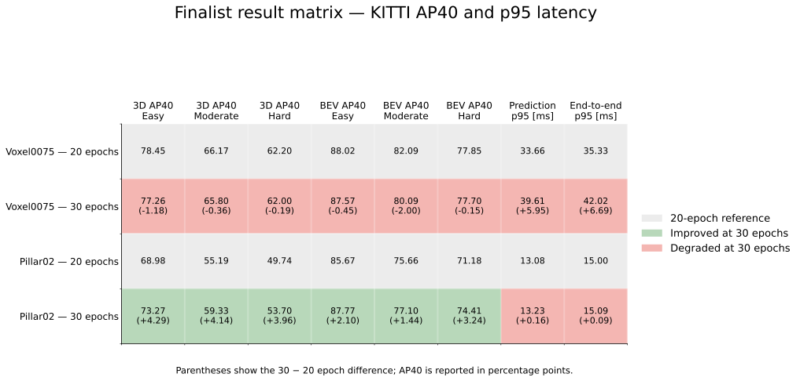
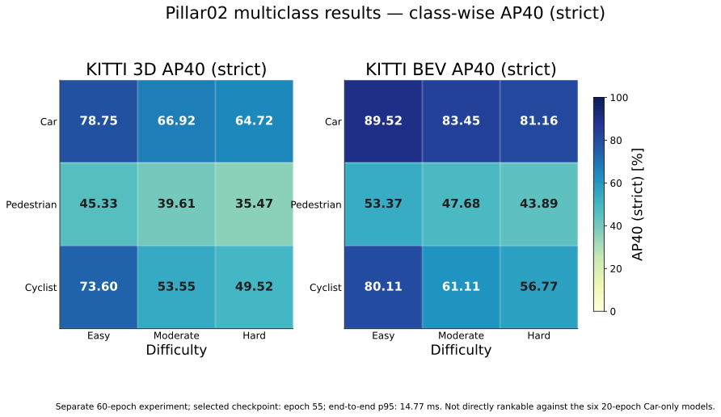

# 1. Címlap

<div align="center">

**LiDAR-alapú 3D járműdetektálás CenterPoint architektúrákkal**

*Műszaki projektdokumentáció*

Készítette: ______________________________<br>
Témavezető: ______________________________<br>
Projektág: 3D pontfelhő-alapú objektumdetektálás<br>
Állapot: a `dev` ág dokumentált állapota

2026. szeptember 4.

</div>

```{=openxml}
<w:p><w:r><w:br w:type="page"/></w:r></w:p>
```

Ez a dokumentum a repository `dev` ágának állapotát rögzíti. A szövegben szereplő saját mérési állítások nem általános szakirodalmi állítások: minden ilyen adat egy konkrét runhoz, konfigurációhoz, kiválasztott checkpointhez és immutable eredményfájlhoz kötődik. A címlapon szereplő személyes mezők kitöltése a dokumentáció átadásakor történhet meg.

# 2. Magyar összefoglaló és kulcsszavak

## 2.1. Összefoglaló

A projekt célja egy LiDAR-pontfelhőből működő, járműdetektálásra optimalizált 3D objektumdetektor kutatási és demonstrációs rendszerének kialakítása. A kutatási oldal az MMDetection3D keretrendszerre épülő CenterPoint modelleket futtat, a futtatásokat pedig olyan run-owned bizonyítékmodellben tárolja, amely együtt kezeli a konfigurációt, az adathalmaz-azonosságot, a checkpointot, a kiértékelést és a benchmarkot. A bemutatási oldal ROS2-n keresztül dolgozza fel a Kaposvár környezetében rögzített Lexus LiDAR-adatot, Foxglove-ban jeleníti meg a pontfelhőt és a detekciókat, majd opcionálisan időbeli stabilizálást végez.

Az első modellkampány hat, kizárólag a `Car` osztályt használó CenterPoint-változatot hasonlított össze 20 epochos tanítással: `pillar02`, `pillar02-dcn`, `voxel01`, `voxel01-dcn`, `voxel0075` és `voxel0075-dcn`. A közös KITTI validation partíción a legjobb közepes nehézségű, szigorú 3D AP40 értéket a `voxel0075` érte el: 66,1696. Ugyanez a modell 35,3310 ms végponttól végpontig mért p95 késleltetést adott. A `pillar02` volt a leggyorsabb, 15,0032 ms p95 mellett 55,1909 AP40 értékkel. A Pareto-elemzés alapján a pontossági finalist a `voxel0075`, a kis késleltetésű finalist a `pillar02`.

A finalisták 30 epochig történő meghosszabbítása két eltérő mintát mutatott. A `voxel0075` 30 epoch után 65,8049 közepes 3D AP40-et és 42,0169 ms p95 késleltetést adott, tehát a 20 epochos változatnál gyengébb lett. A `pillar02` 30 epoch után 59,3263 AP40-re javult, miközben p95 késleltetése csak 15,0919 ms-ra változott. Ezért a demonstráció elsődleges pontossági modellje a 20 epochos `voxel0075`, gyors tartalékmodellje pedig a 30 epochos `pillar02`.

Külön megvalósíthatósági kísérlet készült `Pillar02` architektúrán, 60 epochra, három osztállyal: `Car`, `Pedestrian` és `Cyclist`. A kijelölt checkpoint az epoch 55-höz kötött legjobb modell. A Car 3D AP40 értékei könnyű, közepes és nehéz szinten rendre 78,7537, 66,9236 és 64,7167; az end-to-end p95 14,7736 ms. Ez a kísérlet nem rangsorolható közvetlenül a hat 20 epochos Car-only modellel, mert más feladatot, osztálykészletet, tanítási költséget és célkitűzést képvisel.

A rendszerben az official MMDetection3D PointPillars és SECOND pretrained baseline is megjelent hiteles config-, checkpoint-, evaluation- és benchmark-kötéssel. A két baseline ugyanazon KITTI validation adaton magasabb AP40 értékeket adott, de lényegesen eltérő, hosszabb és érettebb training recipe-t használ, ezért nem tekinthető azonos feltételek melletti rangsornak. Ezek a baseline-ok jelenleg nem szerepelnek a közös Foxglove registryben, és hozzájuk még nem készült baseline Foxglove-videó.

A következtetések érvényességét korlátozza, hogy minden eredmény KITTI validation mérés; sealed KITTI test eredmény nincs. A kísérletek egyetlen seed/run megfigyeléseire támaszkodnak, a KITTI release-version nincs rögzítve, ezért dataset release-version waiver szerepel a comparison JSON-okban. További korlát az ismételt validation-használatból eredő overfitting lehetősége, az eltérő training budget, a teljesen nem annotált Lexus bag, a tracking kvantitatív értékelésének hiánya, az élő DDS loss, a baseline Foxglove-integráció hiánya és a TensorRT-deployment hiánya.

## 2.2. Kulcsszavak

LiDAR; 3D objektumdetektálás; pontfelhő; voxel; pillar; CenterPoint; PointPillars; SECOND; KITTI; MMDetection3D; ROS2; Foxglove; tracking; reprodukálhatóság; immutable evidence.

# 3. Bevezetés, motiváció és célkitűzések

## 3.1. A probléma műszaki jelentősége

Az autonóm és vezetéstámogató rendszerekben a környezet érzékelése több, egymást kiegészítő érzékelőből áll. A kamera gazdag textúrát és színt ad, de a távolság és a geometriai méret közvetlen meghatározása nehezebb. A LiDAR ezzel szemben közvetlen térbeli mintavételt ad: egy pont tipikusan a szenzorhoz viszonyított koordinátát és intenzitás- vagy reflektivitásértéket hordoz. A feladat ebből a rendezetlen, ritka mintából olyan 3D dobozok előállítása, amelyek helyet, méretet, irányt, osztályt és megbízhatósági pontszámot írnak le.

A projektben nem egy általános, minden környezetben kész termék létrehozása volt a cél. A konkrét kérdés az volt, hogy egy azonos adatkészleten, azonos kiértékelési és mérési szerződéssel melyik CenterPoint-alapú voxel- vagy pillar-felbontás ad megfelelő egyensúlyt a járműdetektálási pontosság és az online késleltetés között. Ehhez olyan kutatási folyamat kellett, amelyben egy eredmény nem pusztán egy táblázatsor, hanem visszavezethető artifactlánc.

## 3.2. Célkitűzések

A dokumentált célkitűzések a következők:

1. LiDAR-only CenterPoint detektorok összehasonlítható Car-only kampányának kialakítása.
2. Voxel- és pillar-felbontások, valamint a DCN fejváltozatok vizsgálata.
3. Az accuracy–latency kompromisszum explicit, mérhető modellezése.
4. A legjobb pontosságú és legkisebb késleltetésű finalist kiválasztása, majd 20/30 epochos ellenőrzése.
5. Egy külön multiclass megvalósíthatósági kísérlet végrehajtása.
6. Hivatalos PointPillars és SECOND pretrained referenciák rögzítése, félrevezető azonos budgetű rangsor nélkül.
7. A kiválasztott modellek ROS2- és Foxglove-integrációja, stabil track ID-k és reset-viselkedés biztosítása.
8. A kiértékelési és futtatási bizonyítékok megőrzése úgy, hogy később egy másik fejlesztő ugyanazokat a bemeneteket és azonosításokat ellenőrizhesse.

## 3.3. A siker kritériuma és a hatókör

A kutatási siker kritériuma nem egyetlen abszolút AP-szám volt. A modellnek azonos adatokon, azonos szigorú AP40-profilban kellett mérhetőnek lennie; a benchmarknak rögzített módszertannal kellett futnia; a kiválasztásnak pedig a pontosság és az end-to-end p95 együttesét kellett figyelembe vennie. A 20 Hz-es előzetes runtime cél az end-to-end p95 legfeljebb 50 ms értéke. Ez a cél a vizsgált RTX 2080 Ti munkaállomáson teljesült, de alacsonyabb teljesítményű célhardverre nem terjeszthető ki.

A bemutatási runtime kutatási eszköz maradt. A repository gyökerében található `runtime/` ROS2 csomag szándékosan külön határ, és nem importálja a kutatási modult vagy az MMDetection3D tanítási infrastruktúráját. Fagyasztott, exportált deployment artifact és TensorRT backend még nincs.

# 4. LiDAR és 3D objektumdetektálási háttér

## 4.1. A LiDAR-pontfelhő jellemzői

A LiDAR-szkenner a környezetet irányonként és távolság szerint mintavételezi. A nyers adat nem szabályos kép: a pontok száma, térbeli sűrűsége és megfigyelési minősége függ a tárgy távolságától, felületétől, takarásától és a szenzor forgási ciklusától. Egy pontfelhőben ezért egyszerre jelenik meg a ritkaság, a nem egyenletes mintavétel, a zaj és a mozgó platformból eredő időbeliség.

A projekt bemenete négy csatornát használ: `x`, `y`, `z` és a negyedik LiDAR-funkció, amely a KITTI-előkészítésben a pont intenzitásához/reflektivitásához kötődik. A kamera nem része a kutatási detektor inputjának. Ez lényeges hatókör: a Lexus demonstrációban kamera is megjelenik Foxglove-ban, de a saját detector outputja nem kamera–LiDAR fúzióból származik.

## 4.2. 3D doboz és koordinátarendszer

A detektált objektumot a rendszer hétparaméteres LiDAR-koordinátás dobozzal írja le:

\[
  b = (x, y, z, l, w, h, \theta),
\]

ahol az első három elem a középpont, a következő három a méret, az utolsó pedig a vízszintes elfordulás. A CenterPoint fej ezen kívül középponti hőtérképet, lokális eltolást, magasságot, méretet és rotációt tanul. A repository kompatibilitási rétege a 7D dobozszerződést és a KITTI-kiértékeléshez szükséges formátumot rögzíti.

A pontfelhő tartománya valamennyi saját finalistánál:

\[
  [0, -38{,}4, -3, 67{,}2, 38{,}4, 1]\ \text{m},
\]

és a szűrés a határokon szigorú egyenlőtlenséget alkalmaz. A tartomány egységesítése nélkül a finomabb voxelmodell több térbeli cellát, a runtime pedig más mennyiségű pontot dolgozna fel; így a latency-összevetés és az accuracy comparison is értelmetlenné válna.

## 4.3. Detekciós értékelés

A KITTI objektumdetektálási benchmarkja külön értékeli a 2D, BEV és teljes 3D egyezést [@kitti; @kitti_object]. A projekt elsődleges saját mutatója a `Car_3D_AP40_moderate_strict`, vagyis a Car osztály közepes nehézségű, szigorú 40 recall-pontos 3D AP-ja. A kiegészítő táblák a könnyű és nehéz szinteket, továbbá a BEV AP40-et is mutatják.

Az AP40 azt méri, hogy a pontosság–visszahívás görbe 40 recall-pozícióra mintavételezett területe mekkora. A projektben nem számoltunk vissza olyan adatot, amely nincs az immutable evaluation eredményben: nincs kitalált precision–recall görbe, confusion matrix vagy per-frame statisztika. A multiclass evaluation 126 aggregált metrikát tárol, de párosított predikciós és ground-truth sorozatot nem; ezért abból ilyen grafikon nem vezethető le hitelesen.

## 4.4. Nehézségi szintek és szigorú profil

A KITTI a tárgyak mérete, takarása és truncation értéke alapján könnyű, közepes és nehéz csoportokat használ. A közepes érték a modellválasztás elsődleges kompromisszum-mutatója, míg a könnyű és nehéz szeletek azt mutatják meg, hogy egy változás csak a tipikus, jól látható tárgyakon működik-e, vagy a kedvezőtlenebb példákon is.

A `strict` jelölés nem egyszerű formázási változat, hanem a projekt kompatibilitási rétegében rögzített evaluation profile. A saját, hivatalos és importált runok ugyanazt a KITTI semantic partitiont, annotációt és AP40-kulcsot használják. A release-verzió címkéje hiányzik, ezért a comparison report ezt külön waiverként őrzi.

# 5. Voxel-, pillar-, CenterPoint-, PointPillars- és SECOND-alapok

## 5.1. Voxelizálás és sparse feldolgozás

A voxelizálás a folytonos térfogatot diszkrét cellákra osztja. Ha a térbeli cellaméret `(v_x, v_y, v_z)`, akkor egy pont cellaindexe a tartomány kezdőpontjához képest kvantált koordináta. A kisebb cella jobb térbeli felbontást adhat, de növeli a rács, az előfeldolgozás és a sparse feature computation költségét. A `voxel01` 0,1 m-es, a `voxel0075` 0,075 m-es vízszintes cellát alkalmaz; a kiválasztott Z-felbontásuk 0,1 m. A `pillar02` a teljes 4 m-es Z-tartományt egy cellába sűríti, és 0,2 m-es vízszintes oszlopokat használ.

A 0,2 m-es pillar-rács mérete 336 × 384 × 1. A `voxel01` rácsa 672 × 768 × 40, a `voxel0075` rácsa 896 × 1024 × 40. A finomabb rács nem automatikusan jobb: a detector feje, a sparse middle encoder, a GPU memória és a végponti overhead együtt határozza meg a tényleges eredményt.

## 5.2. PillarFeatureNet és PointPillars

A PointPillars a pontokat függőleges, síkbeli oszlopokba rendezi, majd PointNet-szerű lokális feature-aggregációval minden nem üres oszlophoz vektort készít [@pointpillars]. Az így előálló BEV feature map szabályos 2D konvolúciós hálózattal dolgozható fel. A megközelítés fő előnye, hogy a 3D sparse konvolúció helyett a drága geometriai problémát 2D rácsra vetíti.

A projekt `pillar02` konfigurációja `PillarFeatureNet` encodert, `PointPillarsScatter` middle encodert, majd SECOND backbone-t és SECONDFPN necköt használ. Ez a belső pipeline az elnevezés szerint pillar-alapú CenterPoint, nem pedig a hivatalos PointPillars detector baseline teljes konfigurációja. A két fogalmat ezért a dokumentumban elkülönítjük: `pillar02` a saját CenterPoint fejlesztési konfigurációja, míg az Official PointPillars MMDetection3D pretrained referencia.

## 5.3. SECOND és sparse convolution

A SECOND a voxel feature-öket sparse konvolúciós middle layerrel és region proposal jellegű detekciós felépítéssel dolgozza fel [@second]. A ritka rács előnye, hogy a teljes térbeli dobozt nem kell sűrű tensorban tárolni. A saját `voxel01` és `voxel0075` modellekben a voxel feature encoder, sparse middle encoder, SECOND backbone és SECONDFPN neck együtt adja a CenterPoint fej bemenetét.

A SECOND név két szerepben jelenik meg a repositoryban. Egyrészt a voxel-alapú saját modellek egyik backbone-eleme, másrészt külön Official SECOND baseline, amelynek saját hivatalos configja, pretrained checkpointja és történeti importja van. A baseline összevetésben ezért nem csak a név, hanem a teljes canonical config- és checkpoint-azonosság dönt.

## 5.4. CenterPoint

A CenterPoint a tárgyakat először középpontként detektálja, majd a középpontból regresszálja a méretet, irányt és egyéb attribútumokat [@centerpoint]. Ezzel a detekció nem a sok lehetséges orientációjú anchor enumerációjára támaszkodik. A projekt `KittiCenterHead` feje egy vagy három osztályt kezelő taskot használ, 7D box kódolással, Gaussian focal classification loss-szal és L1 box regressziós loss-szal.

A középponti hőtérkép minden cellában annak valószínűségét kódolja, hogy ott objektumközéppont található. A regressziós ág a diszkrét rácshoz viszonyított finom eltolást, magasságot, dimenziót és rotációt adja vissza. A dekóder ezután a post-center range, a score threshold és a rotated NMS alapján állítja elő a végső dobozokat.

## 5.5. DCN fejváltozatok

A hatmodelles kampány a négy alapfelbontás-változat mellé két deformable convolution fejváltozatot is bevett. A `pillar02-dcn`, `voxel01-dcn` és `voxel0075-dcn` a megfelelő alapmodell `SeparateHead` komponensét `DCNSeparateHead` változatra cseréli. Ez izolált fejváltoztatásként értelmezhető, miközben az adat, a tanítási időkeret, a score/NMS és a benchmark szerződés közös marad.

Az eredmény nem igazolta a DCN hozzáadásának előnyét ebben a kampányban: minden DCN-változatot dominált a megfelelő nem-DCN változat a választott accuracy–latency térben. Ez nem általános állítás a DCN-ről; csak az itt rögzített adatokon, konfigurációkon és egyetlen futáson alapuló megfigyelés.

# 6. KITTI-adathalmaz és adat-előkészítés

## 6.1. KITTI szerepe

A KITTI Vision Benchmark Suite az autonóm vezetéshez kapcsolódó több érzékelős adat- és értékelési feladatokat kínál [@kitti]. A projekt a KITTI Object Detection LiDAR részét használja. A kutatás saját ellenőrzött adatai a `data/KITTI_Obj_Detect/` előkészített könyvtárban vannak, a konfigurációk pedig `kitti_infos_train.pkl` és `kitti_infos_val.pkl` indexekre hivatkoznak.

A rögzített split 3 712 tanító- és 3 769 validation mintát tartalmaz. A train és validation annotációkhoz fájlhash tartozik; a comparison ezen túlmenően dataset identity hash-t is tárol. A release-verzió mező minden releváns comparisonban `null`, ezért a reportokban explicit `accuracy.dataset.version` waiver szerepel. Ez a waiver nem teszi egyenlővé az adatot egy ismeretlen vagy eltérő készlettel: a semantic identity és az annotation hash-ek egyezése a cohorton belül megmaradt.

## 6.2. Pontbetöltés

A tanító pipeline négy dimenziós LiDAR pontokat tölt be `LIDAR` koordinátatípusban. A saját Car-only pipeline sorrendje a következő:

1. pontok betöltése;
2. 3D annotációk és címkék betöltése;
3. globális forgatás, skálázás és opcionális eltolás;
4. vízszintes BEV tükrözés;
5. pont- és objektumtartomány-szűrés;
6. osztályszűrés és pontkeverés;
7. az MMEngine 3D input-szerződésébe csomagolás.

A Car-only kampány szándékosan nem használ `ObjectSample` adatbázis-samplinget. Ennek oka a jelenlegi előkészített adatkészletben hiányzó vagy kompatibilitási problémát okozó ground-plane környezet elkerülése. A multiclass kísérlet külön, a hivatalos MMDetection3D háromosztályos recipe-hoz igazodó adatbázis-sampling beállítást használ, ground plane nélkül. E két pipeline összevonása szakmailag hibás lenne, ezért a multiclass eredmény külön kezelendő.

## 6.3. Validation és test határa

A projektben a `val_dataloader` és `test_dataloader` a rögzített KITTI validation partíciót használja, és az evaluation result semantic partition mezője is `KITTI validation`. A dokumentumban ezért minden AP40 érték validation eredményként szerepel. Sealed KITTI test eredmény nincs, mivel a projekt nem töltött fel hivatalos evaluation szerverre értékelést, és nem rendelkezik a test labels fájljaival.

Ez a megkülönböztetés különösen fontos a finalist kiválasztásnál: ugyanazt a validation adatot használtuk a modellek közötti mérésre, a 30 epochos döntésre és több köztes ellenőrzésre. Emiatt validation overfitting lehetséges. A validation eredmény jó modellválasztási evidence, de nem helyettesít egy előre lezárt, sealed test vizsgálatot.

## 6.4. Adat- és annotációazonosság

A comparison JSON-ok a modellértékek mellett ellenőrzik a következőket: dataset name, semantic partition, dataset identity, train- és validation annotation hash, class schema, metric profile, batch/workload és runtime környezet. Ismeretlen mező nem egyezik automatikusan. Ha egy mező nem áll rendelkezésre, az összehasonlítás csak megmaradó, konkrét waiverrel válik feloldhatóvá.

# 7. Felhasznált technológiák

## 7.1. Kutatási szoftverstack

A futtatási környezet ellenőrzött fő komponensei: Python 3.10.20, PyTorch 2.1.2+cu121, CUDA 12.1, cuDNN 8.9.02, MMEngine 0.10.7, MMCV 2.1.0, MMDetection 3.3.0 és MMDetection3D 1.4.0. A modellek és a tanítási lifecycle PyTorch- és OpenMMLab-komponensekre épül [@pytorch; @mmdetection3d]. A kampány benchmarkja NVIDIA GeForce RTX 2080 Ti kártyán, 575.57.08 NVIDIA driverrel futott.

Az MMDetection3D checkout rögzített verziója v1.4.0, commit `fe25f7a51d36e3702f961e198894580d83c4387b`. A projekt saját kompatibilitási rétege kizárólag a szükséges CenterHead- és KITTI rotated-IoU eltéréseket kezeli. A canonical config, a result és a provenance fájl megőrzi a futtatáskor érvényesített forrásfájl-hash-eket.

## 7.2. Kutatási lifecycle és tárolás

A `research/` csomag felelőssége a run, provenance, checkpoint, training, evaluation, benchmark és comparison. A `research/tools/run.py` a catalog preset vagy explicit config alapján ugyanazon run-owned útvonalat használja. A `train.py`, `evaluate.py`, `benchmark.py`, `compare.py` és `plot.py` explicit identitásokat vár; nem keres globálisan egy „valószínű” checkpointot.

Az immutable eredményfájlok JSON-ban tárolják a bindingot, a payloadot, az állapotot és a provenance-t. A summary CSV-k nem a dokumentáció hivatalos eredményforrásai. A dokumentum számai a resolved comparison JSON-okból és a konkrét evaluation/benchmark `result.json` fájlokból származnak.

## 7.3. ROS2 és megjelenítés

A demonstráció ROS2 Humble interfészekre épül: topicok, üzenettípusok, QoS-profilok, TF és rosbag2/MCAP. A ROS2 kommunikáció topic-alapú, a QoS pedig a history, depth, reliability és durability tulajdonságok kombinációja [@ros2_topics; @ros2_qos]. Foxglove-ban két út használható: élő Foxglove Bridge vagy előre rögzített MCAP visszajátszása [@foxglove_ros2].

A detektorban a ROS és a nehéz ML-importok késleltetve történnek. Így a CLI help, a dry-run és a CPU-alapú tesztek GPU és teljes ROS környezet nélkül is vizsgálhatók. A futó modell azonban továbbra is a zárt finalist registryn keresztül kapja a run- és checkpointkötést.

# 8. A kutatási és futtatási rendszer architektúrája

{#fig:architektura}

*1. ábra. A repository kutatási és ROS2/Foxglove útvonalának szerkezete.*

Adatforrás: a repository tárolt [`rendszerarchitektura.svg`](figures/rendszerarchitektura.svg). Értelmezés: a KITTI és a CenterPoint-konfigurációk tanítási artifactokat hoznak létre; a manifest és az immutable result a zárt finalist registrybe kerül, amely a ROS2 detektort és a Foxglove-megjelenítést szolgálja.

## 8.1. Rétegek és határfelületek

A rendszer két fő része a kutatási lifecycle és a bemutatási playback. A kutatási rész a következő határpontokon működik:

- konfiguráció és dataset előkészítés;
- run és provenance létrehozása;
- train, evaluation és benchmark;
- eredménykötés és comparison;
- finalist artifact registry.

A bemutatási rész a registryből feloldott egyetlen modellt használja. A `Mmdet3dDetector` a checkpointot betölti, a pontfelhő előfeldolgozását és a `pred_instances_3d` kimenetet kezeli, majd `DetectionFrame` szerződést ad a további ROS- és tracking-lépéseknek. A tracker nem a CenterPoint belső feature-jeit fogyasztja, hanem ezt a validált, modellfüggetlen frame-szerződést.

## 8.2. Kutatási ág

A tanítás bemenete a KITTI train split és a canonical MMDetection3D config. A futás létrehozza saját `config.py` másolatát és hash-ét. A training directory a végső epoch checkpointja mellett a kiválasztott, metrikához kötött checkpointot is rögzíti. Az evaluation és benchmark csak explicit run identityval indulhat, eredményeik pedig run ID, config SHA-256 és checkpoint SHA-256 bindingot tartalmaznak.

A comparison nem fedez fel új adatot. A hozzáadott sorokból és a megadott compatibility policyból állít elő rendezett, feloldott jelentést. A dokumentációba kerülő ábrák a megfelelő resolved comparison JSON-okhoz és a végleges asset-manifesthez kötődnek; a summary CSV-k nem hivatalos eredményforrások.

## 8.3. ROS2 playback ág

A bemeneti pontfelhő topicja `/lexus3/os_center/points`, a target frame `lexus3/base_link`. A node a TF-ből kapott kalibrációval a detekciót base frame-be alakítja. A kimeneti prefix a modell aliasát tartalmazza, például `/centerpoint/voxel0075`. Az alap kimenetek a pontfelhő, a nyers `Detection3DArray`, a nyers marker és a diagnosztika; tracking engedélyezésekor ezekhez tracked detection, tracked marker és tracking diagnostics társul.

A node csak a registry által elfogadott aliasokat használja: `voxel0075`, `pillar02` és `pillar02_multiclass`. Az Official PointPillars és Official SECOND alias jelenleg nincs ebben a registryben. Ezért a baseline-ok evaluation és benchmark evidence-e ellenére a közös Foxglove launcherben nem tekinthetők bemutatási modellnek.

## 8.4. Adatút és hibatűrés

A pontfelhő érkezésekor a coordinator queue-ba helyezi a munkát. `all` feldolgozási módban a megengedett queue-kapacitásig minden frame feldolgozható; `latest` módban a node a legfrissebb frame-et részesíti előnyben, és a lecserélt frame-eket számlálja. A worker a generációt minden frame-hez hozzákapcsolja. Loop vagy backward clock jump után az előző generáció eredménye nem publikálható.

Hiányzó vagy érvénytelen TF esetén a frame megáll a TF-szakaszban; a rendszer nem készít kitalált geometriai overlayt. Érvénytelen pontadat és feldolgozási hiba diagnosztikát eredményez. Tracking hiba esetén a tracking állapot és marker törlődik, de a valid nyers detekció továbbra is megmaradhat. Ez a nyers és származtatott kimenet felelősségének tudatos szétválasztása.

# 9. Reprodukálható run-, checkpoint- és evidence-kezelés

## 9.1. Run-owned identitás

Egy run az adott kísérlet névvel azonosított, tartós könyvtára. A manifest legalább a run ID-t, a canonical config útvonalát és hash-ét, a dataset semantic identityt, az annotációs indexek hash-ét, a class schema-t, a training állapotát és a checkpointokat tartalmazza. A kiválasztott checkpoint nem pusztán egy fájlnév: méret és teljes SHA-256 tartozik hozzá.

A run-local config azért fontos, mert a futás idején ténylegesen használt beállításokat kell visszaolvasni. A forrásconfig későbbi változása nem írhatja át a múltbeli futás értelmezését. A manifest a result fájlokkal együtt azt is megmutatja, hogy melyik config és checkpoint került kiértékelésre.

## 9.2. Immutable evaluation és benchmark

Az evaluation `result.json` a modell outputjából származó aggregált KITTI-metrikákat és a bindingot tartalmazza. A benchmark `result.json` a mérési módszertant, hardvert, warm-upot, mérési minta-számot, percentilis-definíciót, memóriát, prediction és end-to-end scope-ot rögzíti. A status csak sikeres, ellenőrizhető futás után `succeeded`.

A latency két fogalma:

- *prediction*: a modell `test_step` ideje a pontbetöltés utáni szinkronizált szakaszban;
- *end-to-end*: `next(iterator) + model.test_step(batch)`, vagyis az input iteratorból történő adat-előkészítés és a modelllépés együtt.

Mindkét időt CUDA-szinkronizációval mérjük. A benchmark 100 warm-up és 1 000 egymást követő minta után számol percentilist, batch size 1, `num_workers=0`, `shuffle=false` és `persistent_workers=false` beállítással. A p95 a lineáris interpolációval számolt `(n-1)q` percentilis.

## 9.3. Evidence pipeline

{#fig:evidence}

*2. ábra. Az immutable saját eredményből a comparisonon és renderelt ábrán át a dokumentációig vezető bizonyítéklánc.*

Adatforrás: a tárolt [`evidence_pipeline.svg`](figures/evidence_pipeline.svg). Értelmezés: a config-, dataset- és checkpoint-identitás előbb a run manifestben kötődik, ebből készül az evaluation és benchmark result, majd a kompatibilitás-ellenőrzött comparison szolgáltat a dokumentációnak feloldott számokat.

## 9.4. Comparison és waiver

A comparison sorai csak azonosítható, kompatibilis runokból állhatnak. Accuracyhoz a dataset identity, class schema, metric profile és semantic partition lényeges; end-to-end runtime-hoz a hardver, host és szoftver környezet is. Az unknown és mismatch értékek nem kapnak csendes egyezést.

Az összes saját comparison egy waiverrel él: a KITTI release label nem volt rögzítve. A pontos `lidar-dataset-v2` identity és a train/validation annotation hash-ek egyeznek, ezért a cohorton belüli összehasonlítás feloldható. A waiver nem állítja, hogy a mérés minden lehetséges KITTI kiadással azonos lenne.

## 9.5. Artifact registry

A zárt finalist registry a modell aliasát, run ID-ját, config SHA-256-át, checkpoint méretét és checkpoint SHA-256-át statikusan rögzíti. Feloldáskor ellenőrzi, hogy a run native, a manifest és a registry egyezik, a checkpoint a run könyvtárában található, hash-e és mérete helyes, valamint a binding visszavezethető. Tetszőleges checkpoint útvonal nem kerülhet be a valós felvétel bemutatási útvonalába.

# 10. A hat Car-only modell és a kísérleti módszertan

## 10.1. A hat modell

A 20 epochos kampány minden sora ugyanazt az egyosztályos `Car` feladatot, KITTI validation partíciót és 7D CenterPoint kimenetet használja.

| Modell | Pillar/voxel felépítés | DCN fej | 3D AP40 moderate | Prediction p95 (ms) | End-to-end p95 (ms) |
| --- | --- | :---: | ---: | ---: | ---: |
| `pillar02` | 0,2 m pillar | nem | 55,1909 | 13,0762 | 15,0032 |
| `pillar02-dcn` | 0,2 m pillar | igen | 54,4764 | 13,2945 | 15,0227 |
| `voxel01` | 0,1 m voxel | nem | 63,4699 | 30,3351 | 32,1264 |
| `voxel01-dcn` | 0,1 m voxel | igen | 63,2037 | 33,5445 | 35,4320 |
| `voxel0075` | 0,075 m voxel | nem | 66,1696 | 33,6592 | 35,3310 |
| `voxel0075-dcn` | 0,075 m voxel | igen | 66,0839 | 35,6219 | 37,6670 |

Adatforrás: az E1 [`fresh-end-to-end-p95.json`](../../research/reports/20260827-six-model-20epoch/fresh-end-to-end-p95.json) és az E2 [`fresh-prediction-p95.json`](../../research/reports/20260827-six-model-20epoch/fresh-prediction-p95.json) resolved comparisonok, minden érték közvetlenül a `rows` objektumokból. Értelmezés: a `voxel0075` adja a legjobb moderate 3D AP40-et, a `pillar02` a legkisebb késleltetést; a DCN minden megfelelő alapmodellnél rontotta ezt a kétcélú profilt.

## 10.2. Közös tanítási beállítások

A Car-only konfigurációk `AdamW` optimalizálót, 1e-4 learning rate-et, 0,01 weight decay-t és 35-ös gradiensnorma-korlátot használnak. A learning rate és momentum két fázisú cosine schedule-lel változik: az első szakasz 0–8 epoch, a második 8–20 epoch. A validation öt epochonként fut, a training batch size 1. A pipeline nem használ object samplinget.

A hat run mindegyike 20 epochot teljesített, és saját successful evaluationt és synchronized benchmarkot kapott. A futtatási logika a tényleges kiválasztott, primary metrichez kapcsolt checkpointot használja; nem a fájlnevet vagy a legutolsó könyvtári fájlt feltételezi.

## 10.3. Mérés és rangsorolás

A pontosság szerinti rendezés csökkenő, a runtime szerinti rendezés növekvő. A resolved comparison competition rankinget használ; egyenlő értékek azonos rangot kapnak és megfelelő ranglyukat meghagyják. A Pareto-frontier olyan modell, amelyet nem dominál egy másik modell egyszerre legalább ugyanilyen pontossággal és legfeljebb ilyen p95 késleltetéssel.

A hat modell end-to-end p95 értéke 50 ms alatt volt ezen a hardveren. Ez csak előzetes 20 Hz evidence. A prediction p95 önmagában nem elegendő a streaming rendszer megítéléséhez, ezért a modellválasztás fő runtime tengelye az end-to-end p95.

## 10.4. Accuracy–latency kompromisszum

{#fig:pareto}

*3. ábra. A hat 20 epochos Car-only modell moderate 3D AP40 és end-to-end p95 koordinátái; a szaggatott vonal a Pareto-frontier, a pontozott vonal az 50 ms cél.*

Adatforrás: E1 [`fresh-end-to-end-p95.json`](../../research/reports/20260827-six-model-20epoch/fresh-end-to-end-p95.json); a végső SVG/PNG az E8 [`manifest.md`](../presentation_assets/final/manifest.md) szerint készült. Értelmezés: a frontier három pontja `pillar02`, `voxel01` és `voxel0075`; ezek különböző pontosság–késleltetés kompromisszumokat képviselnek, míg a DCN-változatok domináltak.

## 10.5. Prediction és end-to-end scope

{#fig:latencyscope}

*4. ábra. A prediction-only és a teljes input-plusz-inference p95 összevetése a hat 20 epochos Car-only modellen.*

Adatforrás: E1 és E2 resolved comparison JSON, E8 [`manifest.md`](../presentation_assets/final/manifest.md). Értelmezés: a két scope sorrendje hasonló; az end-to-end p95 minden modellnél magasabb, mert az input iterator és a hozzá tartozó szinkronizált adatút is beleszámít.

# 11. Eredmények és a Pillar02/Voxel0075 finalisták kiválasztása

## 11.1. A kiválasztás döntési logikája

A `voxel0075` azért lett accuracy finalist, mert mind a hat 20 epochos jelölt között a legmagasabb moderate Car 3D AP40-et érte el, 66,1696 értékkel. A `pillar02` azért lett speed finalist, mert 15,0032 ms end-to-end p95-tel a leggyorsabb volt. A `voxel01` a frontier köztes referenciája maradt, mert 63,4699 AP40 mellett 32,1264 ms p95-tel megmutatja, hogyan változik az érték a finom voxelrács és a pillar megoldás között.

A DCN változatok kiesése nem külön kézi tiltás: a resolved adatok szerint a `pillar02-dcn` a `pillar02`-nél alacsonyabb AP40 és magasabb p95 értéket adott; ugyanígy a két voxel DCN változat is dominált volt a hozzá tartozó nem-DCN modellel szemben.

## 11.2. Részletes Car-only AP40-profil

| Modell | 3D E / M / H AP40 | BEV E / M / H AP40 | Peak allocated / reserved (MiB) | Checkpoint |
| --- | --- | --- | --- | ---: |
| `pillar02` | 68,9758 / 55,1909 / 49,7370 | 85,6702 / 75,6608 / 71,1751 | 147,00 / 428,00 | 27,92 MiB |
| `pillar02-dcn` | 67,8525 / 54,4764 / 49,1181 | 85,0416 / 76,1997 / 70,5335 | 147,15 / 428,00 | 28,07 MiB |
| `voxel01` | 77,0919 / 63,4699 / 59,3189 | 87,8771 / 79,5111 / 75,0574 | 175,38 / 338,00 | 39,27 MiB |
| `voxel01-dcn` | 77,3834 / 63,2037 / 57,1101 | 87,2715 / 79,0291 / 74,2529 | 183,97 / 230,00 | 39,42 MiB |
| `voxel0075` | 78,4480 / 66,1696 / 62,1959 | 88,0176 / 82,0890 / 77,8536 | 100,44 / 170,00 | 39,27 MiB |
| `voxel0075-dcn` | 78,3704 / 66,0839 / 62,0737 | 87,6705 / 81,8192 / 77,6229 | 117,02 / 186,00 | 39,42 MiB |

Adatforrás: E1 resolved `ap40`, `latency_statistics` és memória/checkpoint mezők; a hat run az E1-ben felsorolt evaluation- és benchmark result ID-khez kötött. Értelmezés: a `voxel0075` nemcsak a kiválasztott moderate szeletben, hanem mindhárom 3D AP40 nehézségi szinten a legerősebb; a `pillar02` jelentős pontosságot ad alacsony késleltetés mellett.

## 11.3. A védett bemutatási artifactok

| Szerep | Modell | Epoch | Run ID | Config SHA-256 | Kiválasztott checkpoint SHA-256 |
| --- | --- | ---: | --- | --- | --- |
| Pontossági bemutató | `voxel0075` | 20 | `20260827T092043Z-voxel0075-e583a40f435e3071e0cbd6fc` | `723749a5dc262ed1e57304092f12694d8f062c4a4158e2d65be685a47874c1b5` | `5246b24bfe66a81df3bc6ca94db982f0188b33043f25771c40d02be4bcb22507` |
| Kis késleltetésű tartalék | `pillar02` | 30 | `20260901T195416Z-pillar02-duration30-2720f37cf422c4e55bafd0a6` | `ebed7d29b96cae0812ede9e572ffb1ba054d650ad62cb1c6c8895697fcb3a5d9` | `2606a3448cd9edc97b662b0ea8631ea828ed1ba7fe64578bba1f2f5b650c8cac` |

Adatforrás: E10 [`presentation_handoff.md`](../presentation_handoff.md), valamint a registry és az E3 resolved comparison. Értelmezés: a védett aliasok a run-local artifactokat és teljes SHA-256 értékeket rögzítik; a demonstrációban a `voxel0075` az alapértelmezett, a `pillar02` a gyors fallback.

# 12. A 20 és 30 epochos finalista-vizsgálat

## 12.1. Kísérleti kérdés

A 20 epochos kampány megmutatta a modellválasztást, de nem válaszolta meg, hogy a finalisták túl korán álltak-e le. Ezért a `voxel0075` és a `pillar02` új, 30 epochos futást kapott. A változó nem pusztán a cél epoch volt: a kétfázisú scheduler szakaszai arányosan 0–12 és 12–30 epochra nyúltak. Így a kísérlet a training duration és a schedule duration együttes hatását méri.

## 12.2. Párosított eredmények

| Modell | Epoch | 3D AP40 E / M / H | BEV AP40 E / M / H | Prediction p50 / p95 (ms) | End-to-end p50 / p95 (ms) |
| --- | ---: | --- | --- | --- | --- |
| `voxel0075` | 20 | 78,4480 / 66,1696 / 62,1959 | 88,0176 / 82,0890 / 77,8536 | 31,2469 / 33,6592 | 32,8995 / 35,3310 |
| `voxel0075` | 30 | 77,2638 / 65,8049 / 62,0019 | 87,5701 / 80,0926 / 77,7030 | 32,0940 / 39,6069 | 33,9328 / 42,0169 |
| `pillar02` | 20 | 68,9758 / 55,1909 / 49,7370 | 85,6702 / 75,6608 / 71,1751 | 12,5046 / 13,0762 | 14,2425 / 15,0032 |
| `pillar02` | 30 | 73,2703 / 59,3263 / 53,6976 | 87,7711 / 77,0989 / 74,4106 | 12,6915 / 13,2319 | 14,4154 / 15,0919 |

Adatforrás: E3 [`paired-end-to-end-p95.json`](../../research/reports/20260902-finalists-duration30/paired-end-to-end-p95.json); a négy sor evaluation- és benchmark result ID-hez, valamint run-owned config/checkpoint hash-hez kötött. Értelmezés: a 30 epoch a `pillar02` minden megadott AP40-szeletét javította, a `voxel0075` minden szeletét rontotta; a p95 változása a voxel esetén nagyobb.

## 12.3. A változások számszerűen

| Modell | 3D AP40 E / M / H változás | BEV AP40 E / M / H változás | End-to-end p50 / p95 változás |
| --- | --- | --- | --- |
| `voxel0075` 30–20 | −1,1842 / −0,3647 / −0,1940 | −0,4475 / −1,9964 / −0,1506 | +1,0333 / +6,6860 ms |
| `pillar02` 30–20 | +4,2945 / +4,1354 / +3,9606 | +2,1009 / +1,4381 / +3,2355 | +0,1729 / +0,0886 ms |

Adatforrás: E3 resolved comparison `rows` és a report README-ben rögzített, újraszámolt delta értékek. Értelmezés: a két modell eltérő tanulási pályát mutat; a `pillar02` 30 epochos folytatása hasznosnak, a `voxel0075` folytatása a vizsgált beállításban kedvezőtlennek bizonyult.

## 12.4. Kiválasztási döntés

A 20 epochos `voxel0075` checkpoint marad a pontossági bemutató, mert mind a négy jelölt között magasabb 3D AP40-et és a 30 epochos voxel változatnál minden BEV AP40 szeletben is jobb értéket adott. A 30 epochos `pillar02` lesz a kis késleltetésű tartalék, mert moderate 3D AP40-je 55,1909-ről 59,3263-ra nőtt, miközben az end-to-end p95 15,0032-ről csak 15,0919 ms-ra változott.

A 30 epochos futások epoch 30 checkpointot választottak ki, és mindkettőnél a training, evaluation és benchmark sikeres volt. Ez a döntés nem statisztikai szignifikanciát jelent: minden run egyetlen seed/run megfigyelése, és a validation adatok ismételt használata miatt a folytatás hatása nem tekinthető általános optimalizálási törvénynek.

{#fig:finalistamatrix}

*5. ábra. A finalisták 20/30 epochos AP40- és p95-összevetése; a zárójeles érték a 30−20 különbség.*

Adatforrás: E3 resolved comparison és E8 [`manifest.md`](../presentation_assets/final/manifest.md). Értelmezés: zöld a javuló, piros a romló 30 epochos szelet; a `pillar02` pontossági nyeresége mellett csak kis runtime-növekedés látható.

# 13. A külön multiclass Pillar02 kísérlet

## 13.1. Cél és hatókör

A multiclass vizsgálat kizárólag a `Pillar02` architektúrán készült. A feladat három osztályt használ: `Car`, `Pedestrian` és `Cyclist`. A futás 60 epochig tartott, és a kijelölt checkpoint az epoch 55-höz kötött `best_Kitti metric_pred_instances_3d_KITTI_Car_3D_AP40_moderate_strict_epoch_55.pth`. Ez megvalósíthatósági kísérlet: azt ellenőrzi, hogy a projekt saját kompatibilitási és playback-szerződése képes-e több KITTI osztályt kezelni.

Más architektúrán azért nem futott multiclass kísérlet, mert a projekt fő célja a járműdetektálás maximalizálása lett, a `Pillar02` pedig kisebb időigénnyel tette lehetővé a gyors multiclass vizsgálatot. Az eredmény ezért nem rangsorolható közvetlenül a hat 20 epochos Car-only modellel: eltér az osztálykészlet, a loss- és sampling-környezet, a training budget, a cél és a primary metric kötése.

## 13.2. Osztályonkénti AP40

| Osztály | 3D Easy | 3D Moderate | 3D Hard | BEV Easy | BEV Moderate | BEV Hard |
| --- | ---: | ---: | ---: | ---: | ---: | ---: |
| `Car` | 78,7537 | 66,9236 | 64,7167 | 89,5208 | 83,4507 | 81,1611 |
| `Pedestrian` | 45,3269 | 39,6095 | 35,4650 | 53,3734 | 47,6779 | 43,8853 |
| `Cyclist` | 73,5981 | 53,5531 | 49,5250 | 80,1097 | 61,1100 | 56,7741 |

Adatforrás: E4 immutable [`result.json`](../../research/runs/20260902T125737Z-pillar02-multiclass-faa487143efbe3dba808d9ac/evaluation/20260902T195616343969Z-evaluation-513fc499ed4e49415ee237c2/result.json), a `Kitti metric/pred_instances_3d/KITTI/` kulcsokból. Értelmezés: a Car a legerősebb osztály; a Pedestrian minden 3D és BEV nehézségi szinten alacsonyabb; a Cyclist könnyű szinten még erős, közepes és nehéz szinten nagyobb visszaesést mutat.

{#fig:multiclass}

*6. ábra. A Pillar02 multiclass epoch 55 checkpointjának strict 3D és BEV AP40 értékei.*

Adatforrás: E4 evaluation `result.json`, a renderelt SVG/PNG és az E8 [`manifest.md`](../presentation_assets/final/manifest.md). Értelmezés: az ábra csak az immutable evaluationben meglévő aggregált AP40 értékeket jeleníti meg; nem tartalmaz visszaszámolt confusion matrixot vagy PR-görbét.

## 13.3. Futás- és benchmark-kötés

| Elem | Érték |
| --- | --- |
| Run ID | `20260902T125737Z-pillar02-multiclass-faa487143efbe3dba808d9ac` |
| Config SHA-256 | `b31131058eb44367a6d7daa7a3ee0620d41cf3324fdfd701f1f41d402a50231d` |
| Selected checkpoint SHA-256 | `cf62f3c99ce8ebdbb96eaa467cc44c3bde0a152aa25470ce1cfd11b8ac7c7427` |
| Checkpointméret | 32 452 134 byte |
| Evaluation result ID | `20260902T195616343969Z-evaluation-513fc499ed4e49415ee237c2` |
| Benchmark result ID | `20260902T195651982215Z-benchmark-0001486e79f9c7dd48f28e10` |
| End-to-end p50 / p95 | 14,1904 / 14,7736 ms |
| Peak allocated / reserved | 147,0078 / 428,0000 MiB |

Adatforrás: E5 immutable benchmark [`result.json`](../../research/runs/20260902T125737Z-pillar02-multiclass-faa487143efbe3dba808d9ac/benchmark/20260902T195651982215Z-benchmark-0001486e79f9c7dd48f28e10/result.json) és E6 [`manifest.json`](../../research/runs/20260902T125737Z-pillar02-multiclass-faa487143efbe3dba808d9ac/manifest.json). Értelmezés: a multiclass megvalósíthatósági futás saját artifactlánca teljes; a 14,7736 ms end-to-end p95 a 20 Hz cél alatt van ezen a hardveren, de nem teszi a kísérletet Car-only rangsorjelöltté.

# 14. Official PointPillars és Official SECOND baseline-ok

## 14.1. A baseline szerepe

A baseline fejezet két hivatalos MMDetection3D pretrained modellt tartalmaz: Official PointPillars és Official SECOND. Mindkettőnek hiteles config-, checkpoint-, evaluation- és benchmark-kötése van. A cél egy külső, azonos KITTI validation adaton mért referenciapont létrehozása; nem az, hogy a hosszabb hivatalos recipe-t egy 20/30 epochos saját kísérlettel azonos budgetként rangsoroljuk.

| Modell | Effective training budget | 3D AP40 E / M / H | BEV AP40 E / M / H | Prediction p50 / p95 (ms) | End-to-end p50 / p95 (ms) |
| --- | --- | --- | --- | --- | --- |
| Official SECOND | 80 epoch | 90,4463 / 81,3268 / 76,1806 | 92,6352 / 88,4181 / 85,2526 | 25,7261 / 26,4117 | 28,4831 / 29,5152 |
| Official PointPillars | 160 epoch | 90,3449 / 79,1299 / 76,1566 | 92,7663 / 88,3680 / 85,5054 | 16,7533 / 17,3719 | 19,4831 / 20,2515 |
| Saját `voxel0075` | 20 epoch | 78,4480 / 66,1696 / 62,1959 | 88,0176 / 82,0890 / 77,8536 | 31,2469 / 33,6592 | 32,8995 / 35,3310 |
| Saját `pillar02` | 30 epoch | 73,2703 / 59,3263 / 53,6976 | 87,7711 / 77,0989 / 74,4106 | 12,6915 / 13,2319 | 14,4154 / 15,0919 |

Adatforrás: E7 [`comparison.json`](../../research/reports/20260902-pretrained-baseline-comparison/comparison.json), kizárólag a resolved `rows` mezőből; a riport saját README-je a training budget értelmezését is rögzíti. Értelmezés: a hivatalos modellek magasabb AP40-et adnak, a saját `pillar02` a leggyorsabb; az összevetés eltérő training budget miatt nem azonos feltételek melletti rangsor.

## 14.2. Külső artifactok és configok

| Modell | Hivatalos forrásconfig és SHA-256 | Run ID | Checkpoint SHA-256 |
| --- | --- | --- | --- |
| Official PointPillars | `pointpillars/pointpillars_hv_secfpn_8xb6-160e_kitti-3d-car.py`; `75145966859d3f9f4bc3fcd364ee12e6b3edc221cf1cdea7c70e4274443891dc` | `20260902T101048Z-official-pointpillars-kitti-d42d15edce05b552fdd14e64` | `d42d15edce05b552fdd14e6412fc1d3e02207ee4799e6e3869f61bd30e730f3e` |
| Official SECOND | `second/second_hv_secfpn_8xb6-80e_kitti-3d-car.py`; `a1ca56ed4015a19c79a38ab81e74062cf26737a17611a6521013ad672e8a3c1e` | `20260902T101049Z-official-second-kitti-75d9305e3403e890a32d553c` | `75d9305e3403e890a32d553cc414570f8321086a13edf78f295e628de8fdc851` |

Adatforrás: E9 [`pretrained_baseline_audit.md`](../presentation_assets/final/pretrained_baseline_audit.md) és E7 comparison. Értelmezés: a forrásconfig hash-e és a canonical run-local config hash-e külön mező, mert a local config a KITTI útvonalakhoz és a kompatibilis evaluationhez materializált változat.

## 14.3. Értelmezési korlát

A PointPillars 160 effective epochot, a SECOND 80 effective epochot reprezentál, miközben a saját finalisták 20 és 30 epochos kísérletek. A baseline-ok érettebb recipe-t, eltérő batch- és sampling-beállítást, valamint hosszabb optimalizálást használnak. A magasabb AP ezért elsősorban elérhető referenciapont és fejlesztési cél, nem bizonyíték arra, hogy az architektúra önmagában ennyivel jobb.

Az Official PointPillars és Official SECOND még nincsenek integrálva a közös Foxglove registrybe. A közös playback fix CenterPoint pontfelhő-tartományt feltételez, miközben a baseline-ok eltérő ponttartományt használnak; ezt modell-specifikusan kell feloldani. Baseline Foxglove-videó még nem készült. Emiatt a prezentáció kiválasztása nem változik: a ROS2/Foxglove és tracking acceptance csak a saját finalistákra vonatkozik.

# 15. ROS2-, Foxglove- és tracking-integráció

## 15.1. Detektor és üzenetút

A bemeneti node a Lexus rosbag/MCAP pontfelhőjét fogadja, TF lookup után a pontokat a modell tartományára szűri, majd a kiválasztott run-bound detektort futtatja. A detektor kimenete `DetectionFrame`: session- és frame-index, acquisition timestamp, koordinátakeret, run/config/checkpoint identity, pontszámok, label-ek, 7D dobozok és feldolgozási státusz.

A ROS2 node standard Humble üzeneteket publikál. A nyers kimenet `vision_msgs/msg/Detection3DArray`, a vizualizáció `visualization_msgs/msg/MarkerArray`, a diagnosztika `diagnostic_msgs/msg/DiagnosticArray`, a modell pontfelhője `sensor_msgs/msg/PointCloud2`. Az output prefix minden topicot egy modell-alias alatt tart.

## 15.2. Foxglove panelkiosztás

| Panel | Topic | Tartalom |
| --- | --- | --- |
| 3D pontfelhő | `/centerpoint/voxel0075/model_points` | A modell tartományán belüli pontok |
| Nyers dobozok | `/centerpoint/voxel0075/markers` | Frame-local detekciók |
| Követett dobozok | `/centerpoint/voxel0075/tracked_markers` | Stabil ID, sebesség, trail, coasting |
| Kamera | `/lexus3/camera/zed/zed_node/left/color/rect/image/compressed` | A működő bal kamera képe |
| Detektor diagnosztika | `/centerpoint/voxel0075/diagnostics` | Input, queue, TF és inference állapot |
| Tracking diagnosztika | `/centerpoint/voxel0075/tracking_diagnostics` | Track lifecycle és association állapot |

Adatforrás: E11 [`tracked_foxglove_demo.md`](../tracked_foxglove_demo.md), a repository node- és message-builder implementációja. Értelmezés: a nyers és tracked panelek elkülönítése láthatóvá teszi, hogy a temporal stabilizálás a detector után történik.

## 15.3. QoS és feldolgozási policy

A `/tf_static` megbízható, transient local, keep-last, 100 mélységű QoS-t kap, hogy a később induló playback node is megkaphassa a statikus transzformációt. A pontfelhő subscription policy-matched QoS-t használ. A kimeneti tracked detections reliable, volatile, keep-last 1; a tracked markerek reliable, transient local, keep-last 1; a tracking diagnostics reliable, volatile, keep-last 10.

Két demonstrációs mód van. `all`, queue 32 esetén a bemeneti frame-ek feldolgozása elsődleges. `latest`, queue 1 esetén a frissesség elsődleges, és az új frame lecserélheti a várakozót. A második módnál a replacements számlálása kötelező: az eldobott régi frame nem nevezhető feldolgozási hibának, de zero-drop real-time bizonyítéknak sem.

## 15.4. Tracker algoritmus

A jelenlegi `OnlineBoxTracker` determinisztikus, távolságalapú greedy associationt használ. Először a korábbi track állapotából konstans sebességű előrejelzés készül az acquisition timestamp különbsége alapján. Ezután az osztály-kompatibilis, távolság szerint rendezett lehetséges párok közül kerülnek kiválasztásra a gate-en belüli egyezések. Az aktuális implementáció nem használ Hungarian assignmentet; ilyen állítást a jelenlegi rendszerről nem teszünk.

A default Car association gate 4,0 m, a Pedestrian gate 1,5 m, a Cyclist gate 2,5 m. Egy új track két hit után válik megerősítetté. A megerősített track legfeljebb három hiányzó frame-en és 0,75 s időrésen belül coastolhat. A trail hossza legfeljebb 20 pont, a track ID reset után 1-ről indul.

## 15.5. Reset és életciklus

A ROS clock visszafelé ugrása vagy a pont timestamp deduplikált fallbackje új coordinator generationt indít. A pending queue törlődik, régi generáció eredménye nem publikálható, a TF- és trackerállapot resetel, a tracked marker kimenet pedig `DELETEALL`-t küld. Így a rosbag loop végén az előző kör objektumai nem maradnak a megjelenítésben.

Leállításkor a bag input áll le először, majd a detector, végül a bridge. A folyamatok saját process groupban futnak, a megszüntetés korlátozott grace period után SIGTERM/SIGKILL felé léphet. A tracker kivételénél a nyers detector output továbbra is publikálható, míg a származtatott tracked output törlődik.

## 15.6. Saját Lexus bag mint demonstráció

A saját Lexus bag eredményeit kizárólag kvalitatív demonstrációként kezeljük. A felvétel nincs teljesen annotálva, ezért nem számolható belőle hiteles detection AP, precision–recall, identity-switch, AMOTA vagy egyéb per-frame tracking mutató. A bemutatás azt igazolja, hogy a pontfelhő, kamera, TF, nyers dobozok, stabil ID-k, sebességnyilak és reset-viselkedés együtt megjeleníthető.

A 2026. szeptember 2-án elfogadott fallback MCAP 29,342 s hosszú, 4 651 üzenetet és 13 szükséges input/output topicot tartalmaz, mérete 443,8 MiB. Ez rögzített playback evidence, nem kvantitatív tracking ground truth.

# 16. Tesztelés és megbízhatóság

## 16.1. Kutatási határ tesztelése

A repository kutatási és runtime tesztjei külön felelősségeket vizsgálnak: config loading, run lifecycle, provenance, checkpoint identity, result binding, comparison compatibility, benchmark schema, playback normalization, frame conversion, ROS üzenetek és tracker állapotgép. A dokumentációs feladat részeként nem futtatjuk a teljes kódtesztsuite-ot, traininget, GPU evaluációt, benchmarkot vagy videót; a korábbi projektátadási acceptance eredményeit evidence-ként hivatkozzuk.

A korábban rögzített végső integrációs állapotban a CPU-only suite 592 sikeres tesztet adott CUDA elrejtése mellett. Ez a szám a projekt meglévő release handoff evidence-e, nem új mérés ebben a dokumentációs munkamenetben. A jelen munka a dokumentációs buildre, linkekre, ábrákra, bibliográfiára és diff-integritásra korlátozódik.

## 16.2. Artifact- és comparison-ellenőrzések

A run-owned ellenőrzések minden releváns resultnál azt vizsgálják, hogy a binding run ID-ja, config SHA-256-a és checkpoint SHA-256-a megfelel-e a manifestnek. A checkpoint mérete és újraszámolt hash-e egyezik. A comparison reload ellenőrzi, hogy a kompatibilitási mezők és waiverek megmaradnak-e szerializálás után.

A multiclass artifactnál a persistent selected checkpoint 32 452 134 byte és SHA-256 `cf62f3c99ce8ebdbb96eaa467cc44c3bde0a152aa25470ce1cfd11b8ac7c7427`. A baseline auditban a canonical PointPillars és SECOND checkpointok tényleges mérete és teljes hash-e egyezik a manifesttel. Ezek az ellenőrzések nem bizonyítják a modell abszolút helyességét, de kizárják a csendes artifact-cserét.

## 16.3. Tracker megbízhatósága

A szintetikus tracker benchmark 1 000 iterációt és frame-enként 100 detekciót használt. A mért p50 1,141 ms, a p95 1,620 ms volt a dokumentált 2 ms p95 célhoz képest. Az acceptance célja az algoritmikus overhead és a bounded state ellenőrzése, nem a valós szenzoros tracking pontosságának bizonyítása.

A tesztek ellenőrzik a stabil ID-t, osztályok közötti át nem lépést, class-specific gate-et, konstans sebességű predictiont, coastinget, timestamp resetet, crossing objektumokat, marker törlést és hibabiztonságot. Hungarian assignment teszt nincs, mert az nem része a jelenlegi trackernek.

## 16.4. Élő acceptance és DDS veszteség

A valós playback acceptance során a `voxel0075` 0,5× `all`/queue 32 és 1,0× `latest`/queue 1 módban is végigvitte a pontfelhőt, TF-et, kamerát, nyers detekciót és tracked outputot. A live DDS mindkét sebességnél nem végzetes PointCloud2 loss-t jelzett. A node ezt külön middleware/input figyelmeztetésként diagnosztizálja; nem állítja róla, hogy a tracking algoritmus hibázott.

A mintavételezett 1,0× ponton a freshness policy 327 fogadott frame-ből 103 szándékos replacementet jelzett. Ez azt jelenti, hogy a demonstráció frissességi policyje működött, de nem állítható zero-drop valós idejű bizonyítékként. A tracking diagnostics `failed_tracking_frames=0` maradt, de ez nem pótolja a kvantitatív tracking ground truth hiányát.

# 17. Korlátok és érvényességi feltételek

## 17.1. Adat- és mérési korlátok

Az összes AP40 eredmény KITTI validation eredmény. Nincs sealed KITTI test eredmény, a KITTI release-version nincs rögzítve, és a comparisonok dataset release-version waivert tartalmaznak. Minden modellhez egyetlen seed/run tartozik; nincs több seedből számolt szórás, konfidenciaintervallum vagy statisztikai szignifikancia.

A validation partíciót a fejlesztés során többször használtuk modellválasztásra és finalist-ellenőrzésre. Emiatt validation overfitting lehetséges. A hat modell és a finalisták eltérő training budgetje miatt a 20 és 30 epochos futások nem azonos optimalizálási költségű ablációk; a baseline-ok pedig még ennél is eltérőbb, hosszabb hivatalos recipe-ket használnak.

## 17.2. Saját adatok és tracking

A Lexus bag nincs teljesen annotálva. Az élő demonstráció kizárólag kvalitatív bizonyíték arra, hogy a LiDAR, TF, kamera, detector és post-detection tracker egy futtatási láncban működik. Trackingre nincs kvantitatív ground truth, ezért nincs hiteles precision, recall, IDF1, AMOTA vagy identity-switch eredmény.

A tracker jelenlegi determinisztikus távolságalapú greedy association. Ez kicsi és magyarázható, de sűrű, keresztező vagy erősen takart forgalomban az ID-k felcserélődhetnek. A konstans sebességű extrapoláció nem ego-motion-kompenzált, ezért a platform mozgása a track állapotába kerülhet.

## 17.3. Runtime és deployment

Az élő DDS loss előfordult; a `latest` policyben szándékos frame replacement is történt. A mért 20 Hz cél csak az RTX 2080 Ti konfigurációra vonatkozik, és nem garantálja az alacsonyabb teljesítményű hardver működését. A baseline-ok nincsenek integrálva a közös Foxglove registrybe, baseline Foxglove-videó még nincs. TensorRT-deployment, FP16/INT8 kalibráció és fagyasztott runtime artifact még nincs.

## 17.4. Érvényességi feltételek

Az eredmények akkor reprodukálhatók érdemben, ha ugyanaz a dataset semantic identity és annotation hash, a resolved config, a selected checkpoint, a metric profile, a benchmark workload és a megfelelő szoftver/hardver környezet áll rendelkezésre. Az abszolút időértékek más GPU-n vagy más driveren nem azonosak. Az AP40 csak a rögzített KITTI validation cohorton értelmezhető, és nem ígér azonos viselkedést a Kaposvár saját felvételein.

# 18. Továbbfejlesztési lehetőségek és jövőbeli tervek

A következő terv minden pontját ugyanazzal a négy kérdéssel értékeljük: melyik korlátot oldja, mi a várható előny, milyen ellenőrzési kísérlet döntene róla, és mekkora költséggel vagy kockázattal jár. A sorrend a jelenlegi járműdetektálási célhoz igazodik.

| Terv | Megoldandó korlát | Várható előny | Ellenőrzési kísérlet | Költség vagy kockázat |
| --- | --- | --- | --- | --- |
| Finalisták kontrollált hyperparameter- és loss-tuningja | A 30 epochos eredmény a durationt és schedule-t együtt változtatta; a loss súlyok és learning rate nincsenek izoláltan vizsgálva | A `voxel0075` pontossága javulhat, a `pillar02` nyeresége stabilizálható | Előre rögzített, kis factorial screen ugyanazon spliten: LR, loss weight, score/NMS és scheduler; minden változat saját run/result bindinggal | Több GPU-idő és validation overfitting; a search space gyorsan nő |
| Több seed és sealed test | Egyetlen seed és validation reuse miatt nincs szórás és általánosíthatóság | Stabilabb rangsor, konfidenciaintervallum és valódi generalizációs ellenőrzés | Legalább három seed a finalistákon, egyszer lezárt test-protokollal; test eredményt csak a döntési szabály előzetes rögzítése után publikálni | Jelentős számítási és annotációs/kiértékelési költség; a sealed test kezelése fegyelmet igényel |
| Saját adatok annotálása és domain adaptation | A Lexus bag annotálatlan, KITTI és Ouster/Kaposvár domainje eltér | Saját környezetben mérhető recall, precision és domain-robosztusság | Mintavétel napszak, időjárás és forgalom szerint; train/val/test saját split; KITTI-pretrained és adapted model összevetése | Annotációs munka, adatvédelmi és kalibrációs kockázat; kis saját adat túlillesztést okozhat |
| Multi-sweep és temporal fusion | Az aktuális detector egy frame-re támaszkodik, takarásnál és ritka pontfelhőnél információt veszít | Jobb recall, stabilabb középpont és mozgó tárgyak kezelése | Azonos frame-en single-sweep, multi-sweep és időablakos modell; sweep count, időintervallum és késleltetés külön mérése | Memória- és latency-növekedés, időszinkronizációs hiba, ego-motion szükségessége |
| Több LiDAR és kalibráció | Egy szenzor látómezeje és saját zajprofilja korlátozott; az extrinsic kalibráció kritikus | Kevesebb takarás, nagyobb térbeli coverage és robusztusabb geometria | Több szenzoros replay ismert kalibrációval; szenzoronkénti és fused AP/latency; TF residual ellenőrzés | Szenzorbeszerzés és kalibrációs munka; rossz extrinsic rontja az eredményt |
| Tracker fejlesztése és kvantitatív értékelése | A greedy tracker nem ad benchmarkolt ID-stabilitást, a bag nincs annotálva | Kevesebb ID-switch, jobb coasting és mérhető temporal minőség | Saját szekvenciák frame- és track-annotációja; precision/recall, IDF1, ID-switch, AMOTA; baseline trackerrel összevetés | Nagy annotációs költség, a ground truth létrehozása nehéz és időigényes |
| Hungarian assignment kipróbálása | A távolságrendezett greedy párosítás lokális döntésekkel tévedhet sűrű jelenetben | Globális költségminimalizálás és potenciálisan stabilabb ID-k | Ugyanazon annotált crossing/occlusion szekvencián greedy és Hungarian A/B; ID-switch és update latency mérése | Új függőség vagy saját implementáció validációja; rossz költségfüggvény esetén nem javít |
| Ego-motion kompenzáció | A platform mozgása a konstans sebességű trackben jelenleg nincs leválasztva | Álló objektumok stabilabb trackje, pontosabb velocity | TF/odometria alapján kompenzált és kompenzálatlan tracker ugyanazon bagben; statikus objektum velocity hibája | Odometria/TF minőségétől függ, időszinkronizációs és koordináta-rizikó |
| Baseline Foxglove-integráció | Official PointPillars és SECOND nincs a közös registryben, nincs baseline-videó | Külső referenciák runtime-be mutatása és diagnosztikai összevetése | Model-specifikus range, class schema, alias és marker mapping; CPU fixture, majd rövid GPU smoke és Foxglove acceptance | Registry- és launcher-fejlesztés, eltérő range/QoS; baseline artifact történeti/abszolút útvonala kockázat |
| ROS2/QoS robusztusság | Élő DDS loss és `latest` replacements fordultak elő | Kevesebb inputvesztés, jobban értelmezett backpressure és frissesség | Hálózati és CPU-terheléses replay több QoS-profillal; received, middleware loss, replacements, processed count és end-to-end lag mérése | Middleware-függőség, queue növelése latencyt és memóriát emelhet; reliable mód torlódhat |
| TensorRT FP16/INT8 deployment alacsonyabb teljesítményű hardveren | A PyTorch FP32 kutatási modell nem deployment artifact, a 20 Hz cél célhardveren nincs igazolva | Kisebb latency, memória és energiaigény | ONNX/TensorRT export, FP16 és kalibrált INT8; accuracy drift és p50/p95 alacsonyabb GPU-n; ROS2 end-to-end mérés | Export-kompatibilitás, plugin- és kalibrációs hibák; INT8 pontosságvesztés és hardverbeszerzés |
| nuScenes | A KITTI csak egy domain és egy metric profile; nincs temporal/multiszenzoros összevetés | Általánosabb multimodális és tracking validáció, NDS/mAP/AMOTA kontextus | CenterPoint-kompatibilis nuScenes split, hivatalos eval, sweep és class mapping; KITTI számokat nem keverni a nuScenes metrikákkal | Nagy tárhely, adat- és kódkomplexitás, eltérő class/metric; a current comparison profile bővítendő |
| További multiclass architektúrák | Jelenleg csak Pillar02-n történt multiclass feasibility | Ha a cél túlterjed a járműdetektáláson, összevethető ember- és kerékpárosdetektorok | Csak a cél hivatalos kiterjesztése után, előre rögzített class/budget/split szerint; több architektúra azonos eval/benchmark szerződéssel | Jelentős számítási költség és összehasonlíthatósági kockázat; addig nem indokolt, amíg a fő cél Car maximalizálása |

Adatforrás: a jelenlegi evidence, konfigurációk, handoff és baseline audit alapján összeállított fejlesztési terv; külső módszertani háttérként a CenterPoint és nuScenes [@centerpoint; @nuscenes], deployment irányként a TensorRT dokumentáció [@tensorrt] szolgál. Értelmezés: minden terv konkrét jelenlegi korlátra válaszol, és csak olyan kísérlettel tekinthető eredménynek, amely újra run-owned evidence-et termel.

# 19. Összegzés

A projekt egy dokumentált, LiDAR-only 3D járműdetektálási kutatási utat hozott létre CenterPoint architektúrákkal. A hat Car-only 20 epochos modell közös KITTI validation összevetése alapján a `voxel0075` adta a legjobb pontosságot, a `pillar02` a legkisebb end-to-end p95 késleltetést. A 30 epochos finalist-vizsgálat megmutatta, hogy a hosszabb tanítás modellfüggő: a pillar javult, a voxel romlott. A védett bemutatási döntés ezért a 20 epochos Voxel0075 pontossági és a 30 epochos Pillar02 kis késleltetésű artifactjára épül.

A multiclass rész kizárólag Pillar02 architektúrán, Car/Pedestrian/Cyclist osztályokkal, 60 epochos feasibility kísérletként készült, epoch 55 kijelölt checkpointtal. Eredményei ígéretesek, de nem rangsorolhatók a hat Car-only modellel. A hivatalos PointPillars és SECOND baseline-ok hitelesen kötöttek, ugyanazon validation adaton erősebb AP40 referenciát adnak, de eltérő training budget miatt nem azonos feltételű rangsor.

A repository saját erőssége a bizonyítéklánc: a config, dataset, checkpoint, evaluation, benchmark és comparison egyaránt azonosítható. A ROS2/Foxglove út a kiválasztott modelleket TF-fel, QoS-szal, nyers és tracked topicokkal, determinisztikus távolságalapú greedy trackerrel és reset-életciklussal köti össze. Ugyanakkor az eredmények validation-only, single-seed, release-waiveres evidence-ek; a Lexus demonstráció kvalitatív; élő DDS loss történt; a baseline Foxglove-integráció és a TensorRT deployment hiányzik.

A következő szakmai lépés nem a vak újragenerálás, hanem a finalisták kontrollált tuningja, több seed és sealed test, saját adatok annotálása, időbeli és több-szenzoros kiterjesztés, valamint kvantitatívan értékelt tracker és célhardveres deployment. További multiclass architektúrák csak akkor indokoltak, ha a projekt célja később ténylegesen túlterjed a járműdetektálás maximalizálásán.

# 20. Irodalomjegyzék

::: {#refs}
:::

Az irodalomjegyzék külső szakirodalmi és hivatalos technikai forrásokat tartalmaz. A saját projekt evidence nem keveredik ezek közé: az E1–E11 az alábbi reprodukciós mellékletben és a repository [`evidence_index.md`](evidence_index.md) fájljában szerepel.

# 21. Reprodukciós melléklet

## 21.1. A végleges Word-dokumentum forrása

A szerkeszthető kanonikus forrás ez a fájl: [`projektdokumentacio.md`](projektdokumentacio.md). A végleges átadási deliverable a hozzá tartozó Word DOCX. A Markdown-forrás, a BibTeX-irodalomjegyzék, a számozott hivatkozási stílus és a végleges ábrafájlok a Word-dokumentum ellenőrzését és későbbi karbantartását szolgáló belső munkafájlok.

## 21.2. A hat Car-only run evidence-e

| Modell | Run ID | Evaluation result ID | Benchmark result ID | Config SHA-256 | Selected checkpoint SHA-256 |
| --- | --- | --- | --- | --- | --- |
| `pillar02` | `20260827T092033Z-pillar02-3367910930525d0c12ddc346` | [`result.json`](../../research/runs/20260827T092033Z-pillar02-3367910930525d0c12ddc346/evaluation/20260901T093536573158Z-evaluation-e06d68a8b48bd9b854eaf052/result.json) `20260901T093536573158Z-evaluation-e06d68a8b48bd9b854eaf052` | [`result.json`](../../research/runs/20260827T092033Z-pillar02-3367910930525d0c12ddc346/benchmark/20260901T103846232075Z-benchmark-3e3b0fb771aaacf47599a66d/result.json) `20260901T103846232075Z-benchmark-3e3b0fb771aaacf47599a66d` | `b0c8a5af268a252be25d56d83ad51b7d1c06ff1e7caf3fde6e418eb2af872fd2` | `7814db42c341be87c09ae4e68a0266288227aeac6a98cfb83420b4ffb5caaf8d` |
| `pillar02-dcn` | `20260827T092042Z-pillar02-dcn-17f8f3e630e66376d794960d` | [`result.json`](../../research/runs/20260827T092042Z-pillar02-dcn-17f8f3e630e66376d794960d/evaluation/20260901T093605946058Z-evaluation-ce61985392addbb91ac07485/result.json) `20260901T093605946058Z-evaluation-ce61985392addbb91ac07485` | [`result.json`](../../research/runs/20260827T092042Z-pillar02-dcn-17f8f3e630e66376d794960d/benchmark/20260901T103919909199Z-benchmark-64f38a33a633ba14d1c6700e/result.json) `20260901T103919909199Z-benchmark-64f38a33a633ba14d1c6700e` | `4b9ff9542d30071e13a2f98834279e703f1dbfaa1b0ae28af880cbe1359354ee` | `f24eb4cb51f637ec5f863f2594f6a015cf730c17967bc0d6a231b247e186c92c` |
| `voxel01` | `20260827T092045Z-voxel01-40cd6123fa5b4cdee59306ed` | [`result.json`](../../research/runs/20260827T092045Z-voxel01-40cd6123fa5b4cdee59306ed/evaluation/20260901T093858828163Z-evaluation-526969cdb8c5cd6b85a8ccf8/result.json) `20260901T093858828163Z-evaluation-526969cdb8c5cd6b85a8ccf8` | [`result.json`](../../research/runs/20260827T092045Z-voxel01-40cd6123fa5b4cdee59306ed/benchmark/20260901T104201117381Z-benchmark-e6188523989102d73e2cd36a/result.json) `20260901T104201117381Z-benchmark-e6188523989102d73e2cd36a` | `dd162b8865e1e9eb99c851b38701f4ca5a92f8064c35e24e9c048760b0a72167` | `ccf59e3caa80a890db02907337625cfa09b04cc5c196229d4d70bb908e93ce77` |
| `voxel01-dcn` | `20260827T092046Z-voxel01-dcn-bc6db6f99a45864e67165106` | [`result.json`](../../research/runs/20260827T092046Z-voxel01-dcn-bc6db6f99a45864e67165106/evaluation/20260901T094034238698Z-evaluation-4ee16e9ad16608a9fffc4718/result.json) `20260901T094034238698Z-evaluation-4ee16e9ad16608a9fffc4718` | [`result.json`](../../research/runs/20260827T092046Z-voxel01-dcn-bc6db6f99a45864e67165106/benchmark/20260901T104253301390Z-benchmark-7acb9dc627ededb2ead2734b/result.json) `20260901T104253301390Z-benchmark-7acb9dc627ededb2ead2734b` | `3bb5857490a422bf69822661f78ffcd349e8a450451ec0cf6eb027fb7b338217` | `1d0c7441ec14f7a50a2c08b53d232a60282c93df880488e185fe77ebecccc2c2` |
| `voxel0075` | `20260827T092043Z-voxel0075-e583a40f435e3071e0cbd6fc` | [`result.json`](../../research/runs/20260827T092043Z-voxel0075-e583a40f435e3071e0cbd6fc/evaluation/20260901T093742934083Z-evaluation-1da12da1dcea037b32fcd47a/result.json) `20260901T093742934083Z-evaluation-1da12da1dcea037b32fcd47a` | [`result.json`](../../research/runs/20260827T092043Z-voxel0075-e583a40f435e3071e0cbd6fc/benchmark/20260901T104014393729Z-benchmark-8788ddfdc671d76144efcac4/result.json) `20260901T104014393729Z-benchmark-8788ddfdc671d76144efcac4` | `723749a5dc262ed1e57304092f12694d8f062c4a4158e2d65be685a47874c1b5` | `5246b24bfe66a81df3bc6ca94db982f0188b33043f25771c40d02be4bcb22507` |
| `voxel0075-dcn` | `20260827T092044Z-voxel0075-dcn-04444a4b945b155c3942a099` | [`result.json`](../../research/runs/20260827T092044Z-voxel0075-dcn-04444a4b945b155c3942a099/evaluation/20260901T093838267394Z-evaluation-6a4dd2e8acccca1273132a53/result.json) `20260901T093838267394Z-evaluation-6a4dd2e8acccca1273132a53` | [`result.json`](../../research/runs/20260827T092044Z-voxel0075-dcn-04444a4b945b155c3942a099/benchmark/20260901T104109572525Z-benchmark-f40cac7046c76d3d982c2ccb/result.json) `20260901T104109572525Z-benchmark-f40cac7046c76d3d982c2ccb` | `e30741de06d76ff939daea3da96d044d9d06f0687e7cc55503ffa1a29646414b` | `e8c5c593416aa134d3db33eb35a27bec20b449478f8b9161779593562051be15` |

Adatforrás: E1/E2 comparisonok és a run-owned result fájlok; az útvonalak a repository gyökeréhez képest feloldhatók. Értelmezés: a hat sor teljes artifact- és result-identitást ad a fő kiválasztás újraellenőrzéséhez.

## 21.3. A finalisták, baseline-ok és multiclass resultok

| Kísérlet | Run ID | Evaluation result | Benchmark result | Feloldott comparison / manifest |
| --- | --- | --- | --- | --- |
| `voxel0075` 30 epoch | `20260901T195406Z-voxel0075-duration30-2ad23907052ef315ba8f8675` | [`result.json`](../../research/runs/20260901T195406Z-voxel0075-duration30-2ad23907052ef315ba8f8675/evaluation/20260902T082628281593Z-evaluation-2fdaa37945bd2675c557dfef/result.json) | [`result.json`](../../research/runs/20260901T195406Z-voxel0075-duration30-2ad23907052ef315ba8f8675/benchmark/20260902T083009602325Z-benchmark-f58a76e9462024acdb0df19e/result.json) | E3 [`paired-end-to-end-p95.json`](../../research/reports/20260902-finalists-duration30/paired-end-to-end-p95.json) |
| `pillar02` 30 epoch | `20260901T195416Z-pillar02-duration30-2720f37cf422c4e55bafd0a6` | [`result.json`](../../research/runs/20260901T195416Z-pillar02-duration30-2720f37cf422c4e55bafd0a6/evaluation/20260902T082842231699Z-evaluation-f67bfeac549a966c8ff58b73/result.json) | [`result.json`](../../research/runs/20260901T195416Z-pillar02-duration30-2720f37cf422c4e55bafd0a6/benchmark/20260902T083106887597Z-benchmark-943a7b5978dd17570bd393c9/result.json) | E3 [`paired-end-to-end-p95.json`](../../research/reports/20260902-finalists-duration30/paired-end-to-end-p95.json) |
| Official PointPillars | `20260902T101048Z-official-pointpillars-kitti-d42d15edce05b552fdd14e64` | [`result.json`](../../research/runs/20260902T101048Z-official-pointpillars-kitti-d42d15edce05b552fdd14e64/evaluation/20260902T112255519403Z-evaluation-ab18369ae30ea65e3de72021/result.json) | [`result.json`](../../research/runs/20260902T101048Z-official-pointpillars-kitti-d42d15edce05b552fdd14e64/benchmark/20260902T112454193282Z-benchmark-c18cb367b928352f966fca43/result.json) | E7 [`comparison.json`](../../research/reports/20260902-pretrained-baseline-comparison/comparison.json), E9 audit |
| Official SECOND | `20260902T101049Z-official-second-kitti-75d9305e3403e890a32d553c` | [`result.json`](../../research/runs/20260902T101049Z-official-second-kitti-75d9305e3403e890a32d553c/evaluation/20260902T112255897033Z-evaluation-e7697481d78150aa18f138ce/result.json) | [`result.json`](../../research/runs/20260902T101049Z-official-second-kitti-75d9305e3403e890a32d553c/benchmark/20260902T112545789371Z-benchmark-c1b07f9d5ab96b7737f0b62a/result.json) | E7 [`comparison.json`](../../research/reports/20260902-pretrained-baseline-comparison/comparison.json), E9 audit |
| `pillar02` multiclass | `20260902T125737Z-pillar02-multiclass-faa487143efbe3dba808d9ac` | E4 [`result.json`](../../research/runs/20260902T125737Z-pillar02-multiclass-faa487143efbe3dba808d9ac/evaluation/20260902T195616343969Z-evaluation-513fc499ed4e49415ee237c2/result.json) | E5 [`result.json`](../../research/runs/20260902T125737Z-pillar02-multiclass-faa487143efbe3dba808d9ac/benchmark/20260902T195651982215Z-benchmark-0001486e79f9c7dd48f28e10/result.json) | E6 [`manifest.json`](../../research/runs/20260902T125737Z-pillar02-multiclass-faa487143efbe3dba808d9ac/manifest.json) |

Adatforrás: E3, E4, E5, E6 és E7. Értelmezés: a 30 epochos és baseline összevetés resolved comparisonban marad; a multiclassnak saját evaluation, benchmark és manifest kötése van.

## 21.4. Saját project evidence katalógus

| Azonosító | Saját evidence |
| --- | --- |
| E1 | Hat Car-only modell end-to-end p95 és 3D AP40 resolved comparison |
| E2 | Hat Car-only modell prediction p95 resolved comparison |
| E3 | Finalisták párosított 20/30 epochos comparison |
| E4 | Pillar02 multiclass immutable evaluation result |
| E5 | Pillar02 multiclass immutable benchmark result |
| E6 | Multiclass run manifest, dataset/class/checkpoint identity |
| E7 | Official PointPillars, Official SECOND és saját finalisták resolved comparison |
| E8 | Négy végleges prezentációs ábra manifestje és renderelési kötése |
| E9 | Pretrained baseline config-, checkpoint- és runtime-audit |
| E10 | Védett finalist registry, presentation acceptance és korlátok |
| E11 | ROS2/Foxglove launcher, topic, QoS, tracker és MCAP acceptance |

Adatforrás: az [`evidence_index.md`](evidence_index.md) E1–E11 táblája és az ahhoz kötött immutable/resolved fájlok. Értelmezés: a katalógus elkülöníti a külső szakirodalmat az egyes saját állításokat hordozó run-, result-, manifest- és ábraevidence-től.

Az E1–E11 teljes repository-útvonalait a külön [`evidence_index.md`](evidence_index.md) tartalmazza. A dokumentumban szereplő saját számok a fenti immutable vagy resolved forrásokra vezethetők vissza; a `research/evaluations/summary.csv` és `research/benchmarks/summary.csv` nem hivatalos adatforrás.

## 21.5. Reprodukciós ellenőrzőlista

1. Ellenőrizd a `dev` ágat és a dokumentációs könyvtárat.
2. Ellenőrizd a `references.bib` és `ieee.csl` fájlt, valamint azt, hogy a Word-dokumentum számozott hivatkozásai és irodalomjegyzéke teljes.
3. Ellenőrizd a hivatkozott DOT/SVG és prezentációs PNG/SVG fájlokat.
4. Nyisd meg a szükséges resolved comparison JSON-okat, és a dokumentum tábláit a `rows` mezőkkel vesd össze.
5. A saját modellhez a run ID mellett a config és selected checkpoint SHA-256-át is ellenőrizd.
6. Baseline esetén külön ellenőrizd a historical import státuszt és az eltérő effective training budgetet.
7. A multiclass futást csak feasibility evidence-ként értelmezd, ne keverd a Car-only rangsorba.
8. ROS2 playbackhoz a zárt registryt és a modellhez tartozó range-et használd; ne adj meg tetszőleges checkpoint útvonalat.
9. Élő acceptancekor rögzítsd a DDS loss, queue replacement, reset és processing státuszokat.
10. Saját Lexus eredményből ne számolj AP-t vagy tracking metricet annotáció nélkül.

## 21.6. Megmaradó bizonytalanságok

Megmarad a KITTI release-version waiver, a single-seed korlát, a validation overfitting lehetősége és az eltérő training budgetek hatása. A 20 epochos historical/native runok nem minden esetben őrzik ugyanúgy a seed mezőt, ezért a dokumentum egyetlen run/seed evidence-ről beszél, de nem állít seed-szintű statisztikai stabilitást. A Lexus bag teljes annotációja és a tracking kvantitatív értékelése hiányzik. A live DDS loss és a `latest` replacements miatt a bemutatás nem zero-drop real-time bizonyíték. A baseline Foxglove registry és baseline-videó, valamint a TensorRT FP16/INT8 deployment továbbra is jövőbeli munka.
