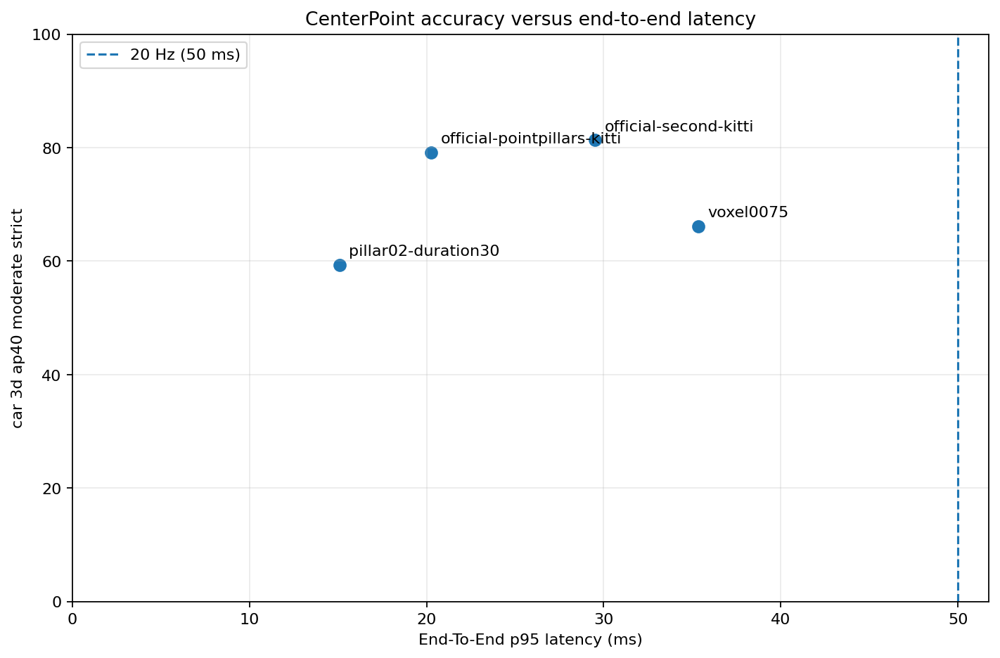
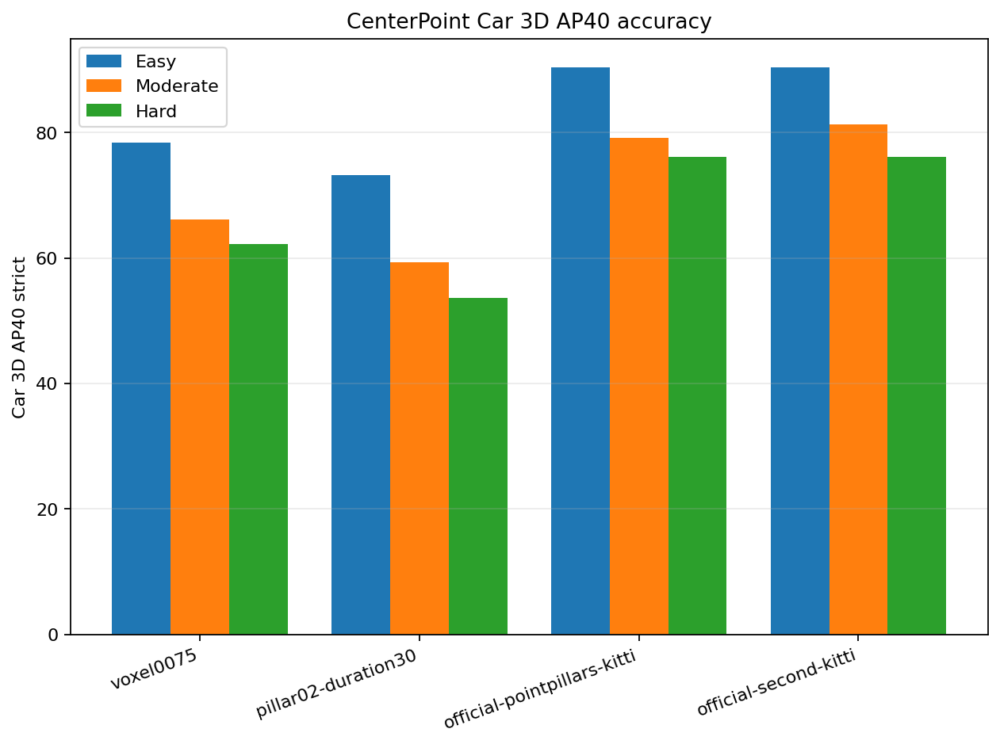
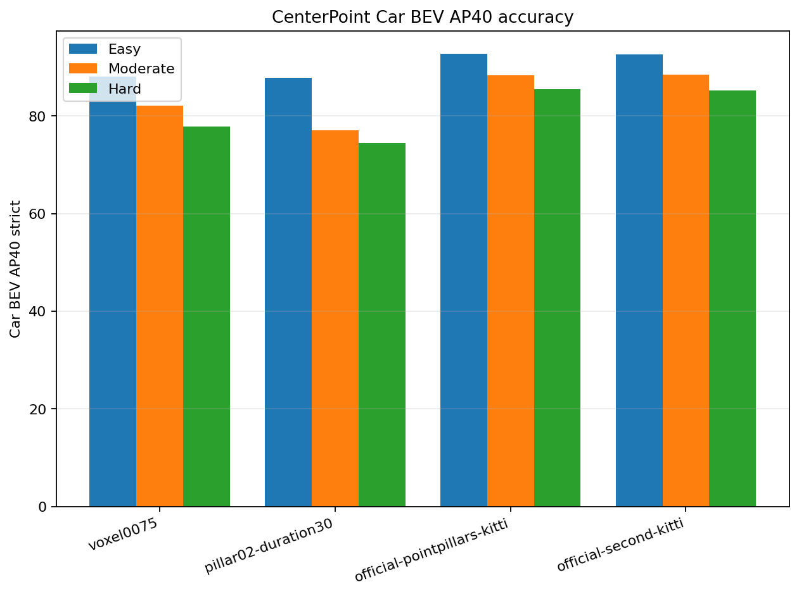
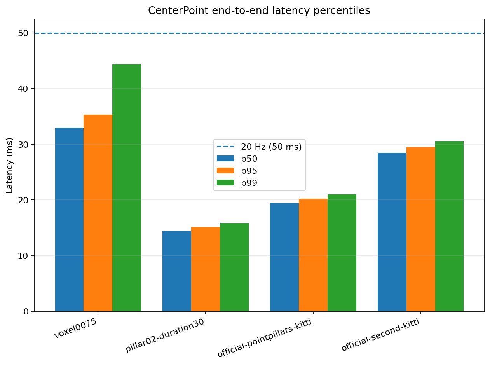
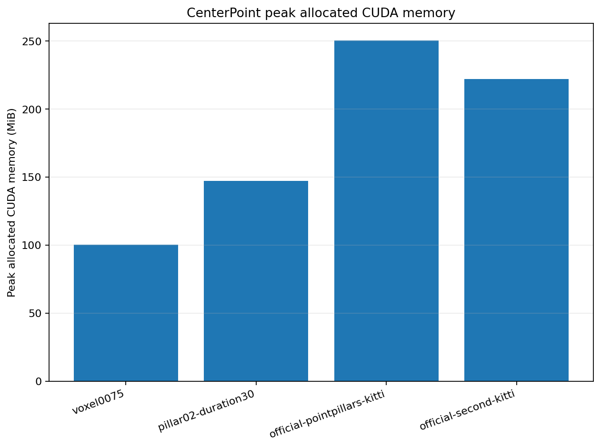
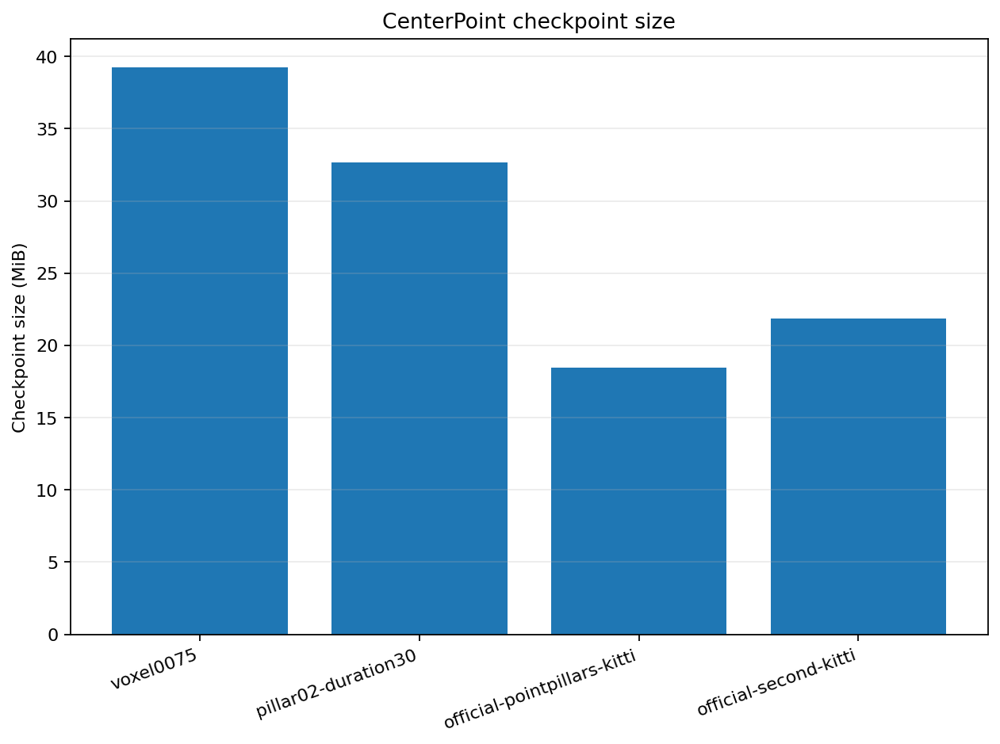
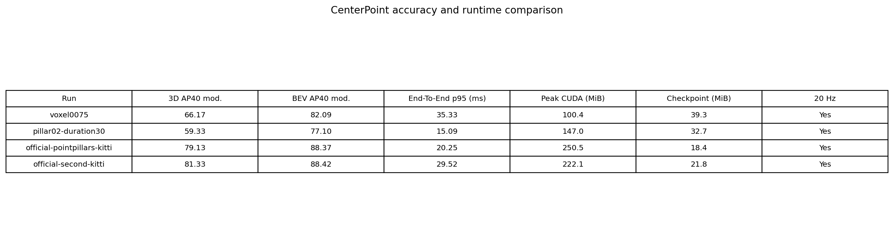

# Pretrained KITTI baseline comparison

## Summary

This report compares the two selected project-trained CenterPoint variants
against two official MMDetection3D pretrained KITTI Car references.

| Model | Training | 3D AP40 E / M / H | BEV AP40 E / M / H | Prediction p50 / p95 | E2E p50 / p95 | Peak allocated / reserved | Checkpoint |
| --- | --- | --- | --- | --- | --- | --- | ---: |
| Official SECOND | 80 effective epochs | 90.4463 / 81.3268 / 76.1806 | 92.6352 / 88.4181 / 85.2526 | 25.7261 / 26.4117 ms | 28.4831 / 29.5152 ms | 222.12 / 408 MiB | 21.83 MiB |
| Official PointPillars | 160 effective epochs | 90.3449 / 79.1299 / 76.1566 | 92.7663 / 88.3680 / 85.5054 | 16.7533 / 17.3719 ms | 19.4831 / 20.2515 ms | 250.52 / 702 MiB | 18.45 MiB |
| Project voxel0075 | 20 epochs | 78.4480 / 66.1696 / 62.1959 | 88.0176 / 82.0890 / 77.8536 | 31.2469 / 33.6592 ms | 32.8995 / 35.3310 ms | 100.44 / 170 MiB | 39.27 MiB |
| Project pillar02 | 30 epochs | 73.2703 / 59.3263 / 53.6976 | 87.7711 / 77.0989 / 74.4106 | 12.6915 / 13.2319 ms | 14.4154 / 15.0919 ms | 147.00 / 428 MiB | 32.67 MiB |

All four models meet the defined 20 Hz requirement of end-to-end p95 no
greater than 50 ms.

## Main trade-off

Official SECOND has the highest moderate strict 3D AP40 at 81.3268. Official
PointPillars is the strongest balanced reference, reaching 79.1299 AP40 with
20.2515 ms end-to-end p95.

The project Pillar model is fastest at 15.0919 ms p95, but trails official
PointPillars by 19.8036 AP40 points. The project Voxel model has the lowest GPU
memory footprint, but the two official references are both more accurate and
faster under this benchmark.

## Accuracy

## Runtime and resource use

## Complete rendered comparison

## Methodology

Accuracy used:

- The identical KITTI validation partition of 3,769 samples.
- The identical `Car` annotations and reduced LiDAR inputs.
- Strict KITTI Car AP40 with IoU 0.70.
- Easy, moderate, and hard 3D and BEV slices.
- Dataset identity
  `0bb26013400c77313f2720b2295f78fc84ba30ef1711b3c769608fa02aa3c8df`.
- Validation annotation SHA-256
  `2afb8fee6347bfb1906fd855440ef08d8fde59255af43b295d96a54d6682bebd`.

The project KITTI compatibility layer replaced only the incompatible rotated
IoU implementation. Official MMDetection3D annotation conversion and AP
calculation remained responsible for the metric semantics.

Runtime used the canonical `mmdet3d_prediction_e2e_sync_v1` methodology:

- NVIDIA GeForce RTX 2080 Ti.
- Batch size 1 and zero data-loader workers.
- FP32 inference without benchmark-enabled autocast.
- 100 leading warm-up samples.
- 1,000 consecutive measured samples.
- Explicit CUDA synchronization.
- Prediction-only and end-to-end timings measured separately.
- Linear-interpolated percentiles and population standard deviation.
- Peak CUDA allocated and reserved memory reset after warm-up.

## External reference provenance

MMDetection3D source:

- Release: v1.4.0.
- Commit: `fe25f7a51d36e3702f961e198894580d83c4387b`.

Official PointPillars:

- Config:
  `pointpillars_hv_secfpn_8xb6-160e_kitti-3d-car.py`.
- Config SHA-256:
  `75145966859d3f9f4bc3fcd364ee12e6b3edc221cf1cdea7c70e4274443891dc`.
- Checkpoint SHA-256:
  `d42d15edce05b552fdd14e6412fc1d3e02207ee4799e6e3869f61bd30e730f3e`.
- Checkpoint runner epoch 80 with dataset repetition factor 2, representing
  160 effective training epochs.
- Canonical run:
  `20260902T101048Z-official-pointpillars-kitti-d42d15edce05b552fdd14e64`.

Official SECOND:

- Config: `second_hv_secfpn_8xb6-80e_kitti-3d-car.py`.
- Config SHA-256:
  `a1ca56ed4015a19c79a38ab81e74062cf26737a17611a6521013ad672e8a3c1e`.
- Checkpoint SHA-256:
  `75d9305e3403e890a32d553cc414570f8321086a13edf78f295e628de8fdc851`.
- Checkpoint runner epoch 40 with dataset repetition factor 2, representing
  80 effective training epochs.
- Canonical run:
  `20260902T101049Z-official-second-kitti-75d9305e3403e890a32d553c`.

Exact selected evaluation and benchmark identities are stored in
[`comparison.json`](comparison.json).

## Interpretation and limitations

This is a same-data inference comparison, but not an equal-training-budget
architecture ablation. The official models use longer schedules, mature
official recipes, larger effective training batches, and database/object
sampling. The project models use single-seed 20- and 30-epoch experimental
training.

The KITTI release label was not recorded. The comparison therefore persists
one explicit waiver while retaining identical dataset identity and exact
train/validation annotation hashes.

These are validation-set results, not untouched sealed-test or statistical
significance claims. KITTI performance also does not guarantee identical
behavior on the Kaposvár Ouster recordings.

Official pretrained CenterPoint is not included because its available
MMDetection3D checkpoint uses nuScenes, different classes, five-dimensional
points, and temporal sweeps. Mixing its nuScenes mAP/NDS with KITTI AP40 would
not be a valid plot.

Tracking is evaluated separately. KITTI object-detection validation does not
provide the sequential tracking ground truth needed for AMOTA or ID metrics.

## Presentation decision

This reference comparison does not silently replace the protected
presentation selection. The project Voxel20 detector remains the accepted
CenterPoint accuracy demo, and Pillar30 remains its low-latency fallback,
because both are integrated with the ROS2/Foxglove tracking path and were
validated on the real presentation recording.

The external references establish an honest accuracy target and identify
longer training, object sampling, and mature training recipes as high-value
post-presentation improvements.
